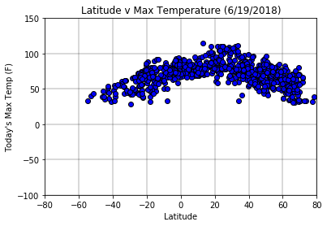
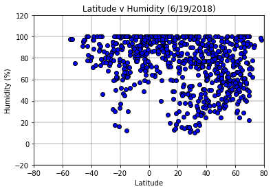
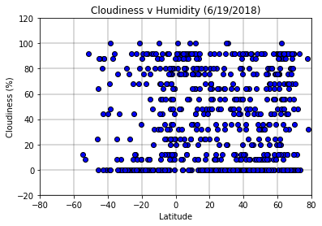
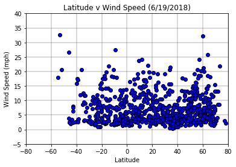
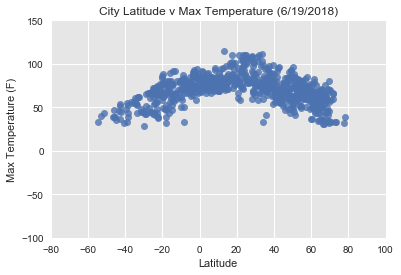
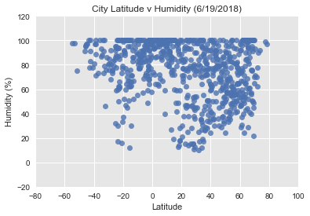
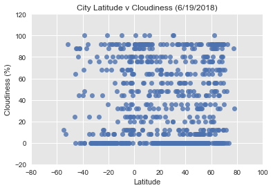
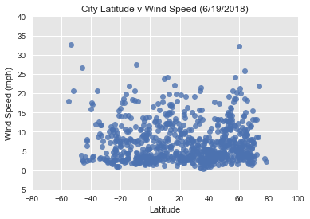

TRENDS:
1) Currently, since it's Summer in the Northern Hemisphere, we see temperatures peak north of the equator at approximately 20 degrees latitude.
2) There is little correlation between latitude and the other variables (humidity, wind speed, cloudiness)
3) When it comes to cloudiness, it tends to be all or nothing. The mode is 0% cloudy. There are fewer cities in the middle range of cloudiness (e.g. 50%)


```python
# Import Dependencies
import os
import pandas as pd
import matplotlib.pyplot as plt
import requests
from pprint import pprint
from config import api_key
import random
from citipy import citipy
import numpy as np
import datetime
import seaborn as sns

now = datetime.datetime.now()
nowDay = f"({now.month}/{now.day}/{now.year})"
```


```python
# API call structure
url = "http://api.openweathermap.org/data/2.5/forecast"
query_params = {
    'appid': api_key,
    'units': 'imperial'
}
```


```python
# Generate cities list
city_list = []
lat_list = []
lon_list = []
fail_list = []
temp_list = []
humid_list = []
cloud_list = []
wind_list = []

count = 0
city_count = 750
print('Beginning Data Retrieval')
print('------------------------------')
while (len(city_list) < city_count and len(fail_list) < city_count):
    # selecting latitude in this way means that the northern-most and southern most cities
    # are most likely to be in the data set because the Earth's circumference is smaller
    # so there are fewer cities  at the polls
    rand_lat = random.uniform(-90, 90)  # Northern most city in dataset is
    rand_lon = random.uniform(-180, 180)  # Northern most city in dataset is
    city = citipy.nearest_city(rand_lat, rand_lon)
    cityName = city.city_name
    if not(cityName in city_list or cityName in fail_list):
        try:
            query_params['q'] = city.city_name
            response = requests.get(url, params=query_params).json()
            
            # get values
            temp = response['list'][0]['main']['temp_max']
            hum = response['list'][0]['main']['humidity']
            cloud = response['list'][0]['clouds']['all']
            wind = response['list'][0]['wind']['speed']
            lat = response['city']['coord']['lat']
            lon = response['city']['coord']['lon']
            
            # filtering out cooridnates far from any city (e.g. at sea)
            if not(abs(lat - rand_lat) > 3 or abs(lon - rand_lon) > 5 ):
            
                temp_list.append(temp)
                humid_list.append(hum)
                cloud_list.append(cloud)
                wind_list.append(wind)
                city_list.append(cityName)
                lat_list.append(lat)
                lon_list.append(lon)
                count = count + 1
                # print log: city number, city name, requested URL
                full_url = url + "?units=" + query_params['units'] + "&APPID=" + query_params['appid']
                cityNameNoSpace = cityName.replace(' ', '%20')
                full_url = full_url + f"&q={cityNameNoSpace}"
                print(f'Processing Record {count} of Set {city_count} | {cityName}')
                print(full_url)
        except KeyError:
            fail_list.append(cityName)
            

            
            
print('------------------------------')
print('Data Retrieval Complete')
print('------------------------------')

```

    Beginning Data Retrieval
    ------------------------------
    Processing Record 1 of Set 750 | bushehr
    http://api.openweathermap.org/data/2.5/forecast?units=imperial&APPID=323f24e26ad39536f176a65b691da3d2&q=bushehr
    Processing Record 2 of Set 750 | najran
    http://api.openweathermap.org/data/2.5/forecast?units=imperial&APPID=323f24e26ad39536f176a65b691da3d2&q=najran
    Processing Record 3 of Set 750 | berezovyy
    http://api.openweathermap.org/data/2.5/forecast?units=imperial&APPID=323f24e26ad39536f176a65b691da3d2&q=berezovyy
    Processing Record 4 of Set 750 | jizan
    http://api.openweathermap.org/data/2.5/forecast?units=imperial&APPID=323f24e26ad39536f176a65b691da3d2&q=jizan
    Processing Record 5 of Set 750 | yerbogachen
    http://api.openweathermap.org/data/2.5/forecast?units=imperial&APPID=323f24e26ad39536f176a65b691da3d2&q=yerbogachen
    Processing Record 6 of Set 750 | ushuaia
    http://api.openweathermap.org/data/2.5/forecast?units=imperial&APPID=323f24e26ad39536f176a65b691da3d2&q=ushuaia
    Processing Record 7 of Set 750 | yucaipa
    http://api.openweathermap.org/data/2.5/forecast?units=imperial&APPID=323f24e26ad39536f176a65b691da3d2&q=yucaipa
    Processing Record 8 of Set 750 | mitzic
    http://api.openweathermap.org/data/2.5/forecast?units=imperial&APPID=323f24e26ad39536f176a65b691da3d2&q=mitzic
    Processing Record 9 of Set 750 | abasolo
    http://api.openweathermap.org/data/2.5/forecast?units=imperial&APPID=323f24e26ad39536f176a65b691da3d2&q=abasolo
    Processing Record 10 of Set 750 | ventspils
    http://api.openweathermap.org/data/2.5/forecast?units=imperial&APPID=323f24e26ad39536f176a65b691da3d2&q=ventspils
    Processing Record 11 of Set 750 | matay
    http://api.openweathermap.org/data/2.5/forecast?units=imperial&APPID=323f24e26ad39536f176a65b691da3d2&q=matay
    Processing Record 12 of Set 750 | trinitapoli
    http://api.openweathermap.org/data/2.5/forecast?units=imperial&APPID=323f24e26ad39536f176a65b691da3d2&q=trinitapoli
    Processing Record 13 of Set 750 | cajati
    http://api.openweathermap.org/data/2.5/forecast?units=imperial&APPID=323f24e26ad39536f176a65b691da3d2&q=cajati
    Processing Record 14 of Set 750 | richards bay
    http://api.openweathermap.org/data/2.5/forecast?units=imperial&APPID=323f24e26ad39536f176a65b691da3d2&q=richards%20bay
    Processing Record 15 of Set 750 | tevriz
    http://api.openweathermap.org/data/2.5/forecast?units=imperial&APPID=323f24e26ad39536f176a65b691da3d2&q=tevriz
    Processing Record 16 of Set 750 | tigil
    http://api.openweathermap.org/data/2.5/forecast?units=imperial&APPID=323f24e26ad39536f176a65b691da3d2&q=tigil
    Processing Record 17 of Set 750 | castres
    http://api.openweathermap.org/data/2.5/forecast?units=imperial&APPID=323f24e26ad39536f176a65b691da3d2&q=castres
    Processing Record 18 of Set 750 | russkaya polyana
    http://api.openweathermap.org/data/2.5/forecast?units=imperial&APPID=323f24e26ad39536f176a65b691da3d2&q=russkaya%20polyana
    Processing Record 19 of Set 750 | ramnagar
    http://api.openweathermap.org/data/2.5/forecast?units=imperial&APPID=323f24e26ad39536f176a65b691da3d2&q=ramnagar
    Processing Record 20 of Set 750 | olive branch
    http://api.openweathermap.org/data/2.5/forecast?units=imperial&APPID=323f24e26ad39536f176a65b691da3d2&q=olive%20branch
    Processing Record 21 of Set 750 | ashtian
    http://api.openweathermap.org/data/2.5/forecast?units=imperial&APPID=323f24e26ad39536f176a65b691da3d2&q=ashtian
    Processing Record 22 of Set 750 | mehran
    http://api.openweathermap.org/data/2.5/forecast?units=imperial&APPID=323f24e26ad39536f176a65b691da3d2&q=mehran
    Processing Record 23 of Set 750 | udachnyy
    http://api.openweathermap.org/data/2.5/forecast?units=imperial&APPID=323f24e26ad39536f176a65b691da3d2&q=udachnyy
    Processing Record 24 of Set 750 | kajaani
    http://api.openweathermap.org/data/2.5/forecast?units=imperial&APPID=323f24e26ad39536f176a65b691da3d2&q=kajaani
    Processing Record 25 of Set 750 | upata
    http://api.openweathermap.org/data/2.5/forecast?units=imperial&APPID=323f24e26ad39536f176a65b691da3d2&q=upata
    Processing Record 26 of Set 750 | taoudenni
    http://api.openweathermap.org/data/2.5/forecast?units=imperial&APPID=323f24e26ad39536f176a65b691da3d2&q=taoudenni
    Processing Record 27 of Set 750 | kangaatsiaq
    http://api.openweathermap.org/data/2.5/forecast?units=imperial&APPID=323f24e26ad39536f176a65b691da3d2&q=kangaatsiaq
    Processing Record 28 of Set 750 | zamora
    http://api.openweathermap.org/data/2.5/forecast?units=imperial&APPID=323f24e26ad39536f176a65b691da3d2&q=zamora
    Processing Record 29 of Set 750 | ust-kishert
    http://api.openweathermap.org/data/2.5/forecast?units=imperial&APPID=323f24e26ad39536f176a65b691da3d2&q=ust-kishert
    Processing Record 30 of Set 750 | minot
    http://api.openweathermap.org/data/2.5/forecast?units=imperial&APPID=323f24e26ad39536f176a65b691da3d2&q=minot
    Processing Record 31 of Set 750 | marsh harbour
    http://api.openweathermap.org/data/2.5/forecast?units=imperial&APPID=323f24e26ad39536f176a65b691da3d2&q=marsh%20harbour
    Processing Record 32 of Set 750 | guerrero negro
    http://api.openweathermap.org/data/2.5/forecast?units=imperial&APPID=323f24e26ad39536f176a65b691da3d2&q=guerrero%20negro
    Processing Record 33 of Set 750 | nuevo progreso
    http://api.openweathermap.org/data/2.5/forecast?units=imperial&APPID=323f24e26ad39536f176a65b691da3d2&q=nuevo%20progreso
    Processing Record 34 of Set 750 | rikitea
    http://api.openweathermap.org/data/2.5/forecast?units=imperial&APPID=323f24e26ad39536f176a65b691da3d2&q=rikitea
    Processing Record 35 of Set 750 | royan
    http://api.openweathermap.org/data/2.5/forecast?units=imperial&APPID=323f24e26ad39536f176a65b691da3d2&q=royan
    Processing Record 36 of Set 750 | amaigbo
    http://api.openweathermap.org/data/2.5/forecast?units=imperial&APPID=323f24e26ad39536f176a65b691da3d2&q=amaigbo
    Processing Record 37 of Set 750 | camocim
    http://api.openweathermap.org/data/2.5/forecast?units=imperial&APPID=323f24e26ad39536f176a65b691da3d2&q=camocim
    Processing Record 38 of Set 750 | tucumcari
    http://api.openweathermap.org/data/2.5/forecast?units=imperial&APPID=323f24e26ad39536f176a65b691da3d2&q=tucumcari
    Processing Record 39 of Set 750 | maniitsoq
    http://api.openweathermap.org/data/2.5/forecast?units=imperial&APPID=323f24e26ad39536f176a65b691da3d2&q=maniitsoq
    Processing Record 40 of Set 750 | benghazi
    http://api.openweathermap.org/data/2.5/forecast?units=imperial&APPID=323f24e26ad39536f176a65b691da3d2&q=benghazi
    Processing Record 41 of Set 750 | viedma
    http://api.openweathermap.org/data/2.5/forecast?units=imperial&APPID=323f24e26ad39536f176a65b691da3d2&q=viedma
    Processing Record 42 of Set 750 | tiarei
    http://api.openweathermap.org/data/2.5/forecast?units=imperial&APPID=323f24e26ad39536f176a65b691da3d2&q=tiarei
    Processing Record 43 of Set 750 | jaguaribe
    http://api.openweathermap.org/data/2.5/forecast?units=imperial&APPID=323f24e26ad39536f176a65b691da3d2&q=jaguaribe
    Processing Record 44 of Set 750 | carahue
    http://api.openweathermap.org/data/2.5/forecast?units=imperial&APPID=323f24e26ad39536f176a65b691da3d2&q=carahue
    Processing Record 45 of Set 750 | weligama
    http://api.openweathermap.org/data/2.5/forecast?units=imperial&APPID=323f24e26ad39536f176a65b691da3d2&q=weligama
    Processing Record 46 of Set 750 | kloulklubed
    http://api.openweathermap.org/data/2.5/forecast?units=imperial&APPID=323f24e26ad39536f176a65b691da3d2&q=kloulklubed
    Processing Record 47 of Set 750 | mackenzie
    http://api.openweathermap.org/data/2.5/forecast?units=imperial&APPID=323f24e26ad39536f176a65b691da3d2&q=mackenzie
    Processing Record 48 of Set 750 | chokurdakh
    http://api.openweathermap.org/data/2.5/forecast?units=imperial&APPID=323f24e26ad39536f176a65b691da3d2&q=chokurdakh
    Processing Record 49 of Set 750 | port augusta
    http://api.openweathermap.org/data/2.5/forecast?units=imperial&APPID=323f24e26ad39536f176a65b691da3d2&q=port%20augusta
    Processing Record 50 of Set 750 | dongying
    http://api.openweathermap.org/data/2.5/forecast?units=imperial&APPID=323f24e26ad39536f176a65b691da3d2&q=dongying
    Processing Record 51 of Set 750 | alofi
    http://api.openweathermap.org/data/2.5/forecast?units=imperial&APPID=323f24e26ad39536f176a65b691da3d2&q=alofi
    Processing Record 52 of Set 750 | myitkyina
    http://api.openweathermap.org/data/2.5/forecast?units=imperial&APPID=323f24e26ad39536f176a65b691da3d2&q=myitkyina
    Processing Record 53 of Set 750 | puerto ayora
    http://api.openweathermap.org/data/2.5/forecast?units=imperial&APPID=323f24e26ad39536f176a65b691da3d2&q=puerto%20ayora
    Processing Record 54 of Set 750 | bosaso
    http://api.openweathermap.org/data/2.5/forecast?units=imperial&APPID=323f24e26ad39536f176a65b691da3d2&q=bosaso
    Processing Record 55 of Set 750 | tromso
    http://api.openweathermap.org/data/2.5/forecast?units=imperial&APPID=323f24e26ad39536f176a65b691da3d2&q=tromso
    Processing Record 56 of Set 750 | churu
    http://api.openweathermap.org/data/2.5/forecast?units=imperial&APPID=323f24e26ad39536f176a65b691da3d2&q=churu
    Processing Record 57 of Set 750 | deputatskiy
    http://api.openweathermap.org/data/2.5/forecast?units=imperial&APPID=323f24e26ad39536f176a65b691da3d2&q=deputatskiy
    Processing Record 58 of Set 750 | bolobo
    http://api.openweathermap.org/data/2.5/forecast?units=imperial&APPID=323f24e26ad39536f176a65b691da3d2&q=bolobo
    Processing Record 59 of Set 750 | taunggyi
    http://api.openweathermap.org/data/2.5/forecast?units=imperial&APPID=323f24e26ad39536f176a65b691da3d2&q=taunggyi
    Processing Record 60 of Set 750 | mehriz
    http://api.openweathermap.org/data/2.5/forecast?units=imperial&APPID=323f24e26ad39536f176a65b691da3d2&q=mehriz
    Processing Record 61 of Set 750 | nemuro
    http://api.openweathermap.org/data/2.5/forecast?units=imperial&APPID=323f24e26ad39536f176a65b691da3d2&q=nemuro
    Processing Record 62 of Set 750 | laredo
    http://api.openweathermap.org/data/2.5/forecast?units=imperial&APPID=323f24e26ad39536f176a65b691da3d2&q=laredo
    Processing Record 63 of Set 750 | khatanga
    http://api.openweathermap.org/data/2.5/forecast?units=imperial&APPID=323f24e26ad39536f176a65b691da3d2&q=khatanga
    Processing Record 64 of Set 750 | falun
    http://api.openweathermap.org/data/2.5/forecast?units=imperial&APPID=323f24e26ad39536f176a65b691da3d2&q=falun
    Processing Record 65 of Set 750 | kavieng
    http://api.openweathermap.org/data/2.5/forecast?units=imperial&APPID=323f24e26ad39536f176a65b691da3d2&q=kavieng
    Processing Record 66 of Set 750 | savannah bight
    http://api.openweathermap.org/data/2.5/forecast?units=imperial&APPID=323f24e26ad39536f176a65b691da3d2&q=savannah%20bight
    Processing Record 67 of Set 750 | dudinka
    http://api.openweathermap.org/data/2.5/forecast?units=imperial&APPID=323f24e26ad39536f176a65b691da3d2&q=dudinka
    Processing Record 68 of Set 750 | bilibino
    http://api.openweathermap.org/data/2.5/forecast?units=imperial&APPID=323f24e26ad39536f176a65b691da3d2&q=bilibino
    Processing Record 69 of Set 750 | zyryanka
    http://api.openweathermap.org/data/2.5/forecast?units=imperial&APPID=323f24e26ad39536f176a65b691da3d2&q=zyryanka
    Processing Record 70 of Set 750 | emirdag
    http://api.openweathermap.org/data/2.5/forecast?units=imperial&APPID=323f24e26ad39536f176a65b691da3d2&q=emirdag
    Processing Record 71 of Set 750 | brisbane
    http://api.openweathermap.org/data/2.5/forecast?units=imperial&APPID=323f24e26ad39536f176a65b691da3d2&q=brisbane
    Processing Record 72 of Set 750 | ankang
    http://api.openweathermap.org/data/2.5/forecast?units=imperial&APPID=323f24e26ad39536f176a65b691da3d2&q=ankang
    Processing Record 73 of Set 750 | gornopravdinsk
    http://api.openweathermap.org/data/2.5/forecast?units=imperial&APPID=323f24e26ad39536f176a65b691da3d2&q=gornopravdinsk
    Processing Record 74 of Set 750 | satara
    http://api.openweathermap.org/data/2.5/forecast?units=imperial&APPID=323f24e26ad39536f176a65b691da3d2&q=satara
    Processing Record 75 of Set 750 | longyearbyen
    http://api.openweathermap.org/data/2.5/forecast?units=imperial&APPID=323f24e26ad39536f176a65b691da3d2&q=longyearbyen
    Processing Record 76 of Set 750 | mukhen
    http://api.openweathermap.org/data/2.5/forecast?units=imperial&APPID=323f24e26ad39536f176a65b691da3d2&q=mukhen
    Processing Record 77 of Set 750 | killybegs
    http://api.openweathermap.org/data/2.5/forecast?units=imperial&APPID=323f24e26ad39536f176a65b691da3d2&q=killybegs
    Processing Record 78 of Set 750 | nouakchott
    http://api.openweathermap.org/data/2.5/forecast?units=imperial&APPID=323f24e26ad39536f176a65b691da3d2&q=nouakchott
    Processing Record 79 of Set 750 | gorontalo
    http://api.openweathermap.org/data/2.5/forecast?units=imperial&APPID=323f24e26ad39536f176a65b691da3d2&q=gorontalo
    Processing Record 80 of Set 750 | laukaa
    http://api.openweathermap.org/data/2.5/forecast?units=imperial&APPID=323f24e26ad39536f176a65b691da3d2&q=laukaa
    Processing Record 81 of Set 750 | kapit
    http://api.openweathermap.org/data/2.5/forecast?units=imperial&APPID=323f24e26ad39536f176a65b691da3d2&q=kapit
    Processing Record 82 of Set 750 | sisimiut
    http://api.openweathermap.org/data/2.5/forecast?units=imperial&APPID=323f24e26ad39536f176a65b691da3d2&q=sisimiut
    Processing Record 83 of Set 750 | butaritari
    http://api.openweathermap.org/data/2.5/forecast?units=imperial&APPID=323f24e26ad39536f176a65b691da3d2&q=butaritari
    Processing Record 84 of Set 750 | wenling
    http://api.openweathermap.org/data/2.5/forecast?units=imperial&APPID=323f24e26ad39536f176a65b691da3d2&q=wenling
    Processing Record 85 of Set 750 | tuchola
    http://api.openweathermap.org/data/2.5/forecast?units=imperial&APPID=323f24e26ad39536f176a65b691da3d2&q=tuchola
    Processing Record 86 of Set 750 | port blair
    http://api.openweathermap.org/data/2.5/forecast?units=imperial&APPID=323f24e26ad39536f176a65b691da3d2&q=port%20blair
    Processing Record 87 of Set 750 | leningradskiy
    http://api.openweathermap.org/data/2.5/forecast?units=imperial&APPID=323f24e26ad39536f176a65b691da3d2&q=leningradskiy
    Processing Record 88 of Set 750 | suez
    http://api.openweathermap.org/data/2.5/forecast?units=imperial&APPID=323f24e26ad39536f176a65b691da3d2&q=suez
    Processing Record 89 of Set 750 | fereydun kenar
    http://api.openweathermap.org/data/2.5/forecast?units=imperial&APPID=323f24e26ad39536f176a65b691da3d2&q=fereydun%20kenar
    Processing Record 90 of Set 750 | aasiaat
    http://api.openweathermap.org/data/2.5/forecast?units=imperial&APPID=323f24e26ad39536f176a65b691da3d2&q=aasiaat
    Processing Record 91 of Set 750 | murgab
    http://api.openweathermap.org/data/2.5/forecast?units=imperial&APPID=323f24e26ad39536f176a65b691da3d2&q=murgab
    Processing Record 92 of Set 750 | chiredzi
    http://api.openweathermap.org/data/2.5/forecast?units=imperial&APPID=323f24e26ad39536f176a65b691da3d2&q=chiredzi
    Processing Record 93 of Set 750 | muriti
    http://api.openweathermap.org/data/2.5/forecast?units=imperial&APPID=323f24e26ad39536f176a65b691da3d2&q=muriti
    Processing Record 94 of Set 750 | gunjur
    http://api.openweathermap.org/data/2.5/forecast?units=imperial&APPID=323f24e26ad39536f176a65b691da3d2&q=gunjur
    Processing Record 95 of Set 750 | alta floresta
    http://api.openweathermap.org/data/2.5/forecast?units=imperial&APPID=323f24e26ad39536f176a65b691da3d2&q=alta%20floresta
    Processing Record 96 of Set 750 | hajipur
    http://api.openweathermap.org/data/2.5/forecast?units=imperial&APPID=323f24e26ad39536f176a65b691da3d2&q=hajipur
    Processing Record 97 of Set 750 | dourbali
    http://api.openweathermap.org/data/2.5/forecast?units=imperial&APPID=323f24e26ad39536f176a65b691da3d2&q=dourbali
    Processing Record 98 of Set 750 | iqaluit
    http://api.openweathermap.org/data/2.5/forecast?units=imperial&APPID=323f24e26ad39536f176a65b691da3d2&q=iqaluit
    Processing Record 99 of Set 750 | yakovlevka
    http://api.openweathermap.org/data/2.5/forecast?units=imperial&APPID=323f24e26ad39536f176a65b691da3d2&q=yakovlevka
    Processing Record 100 of Set 750 | tacuati
    http://api.openweathermap.org/data/2.5/forecast?units=imperial&APPID=323f24e26ad39536f176a65b691da3d2&q=tacuati
    Processing Record 101 of Set 750 | seoul
    http://api.openweathermap.org/data/2.5/forecast?units=imperial&APPID=323f24e26ad39536f176a65b691da3d2&q=seoul
    Processing Record 102 of Set 750 | finschhafen
    http://api.openweathermap.org/data/2.5/forecast?units=imperial&APPID=323f24e26ad39536f176a65b691da3d2&q=finschhafen
    Processing Record 103 of Set 750 | monrovia
    http://api.openweathermap.org/data/2.5/forecast?units=imperial&APPID=323f24e26ad39536f176a65b691da3d2&q=monrovia
    Processing Record 104 of Set 750 | amalapuram
    http://api.openweathermap.org/data/2.5/forecast?units=imperial&APPID=323f24e26ad39536f176a65b691da3d2&q=amalapuram
    Processing Record 105 of Set 750 | awbari
    http://api.openweathermap.org/data/2.5/forecast?units=imperial&APPID=323f24e26ad39536f176a65b691da3d2&q=awbari
    Processing Record 106 of Set 750 | north platte
    http://api.openweathermap.org/data/2.5/forecast?units=imperial&APPID=323f24e26ad39536f176a65b691da3d2&q=north%20platte
    Processing Record 107 of Set 750 | leh
    http://api.openweathermap.org/data/2.5/forecast?units=imperial&APPID=323f24e26ad39536f176a65b691da3d2&q=leh
    Processing Record 108 of Set 750 | suluq
    http://api.openweathermap.org/data/2.5/forecast?units=imperial&APPID=323f24e26ad39536f176a65b691da3d2&q=suluq
    Processing Record 109 of Set 750 | aswan
    http://api.openweathermap.org/data/2.5/forecast?units=imperial&APPID=323f24e26ad39536f176a65b691da3d2&q=aswan
    Processing Record 110 of Set 750 | sarakhs
    http://api.openweathermap.org/data/2.5/forecast?units=imperial&APPID=323f24e26ad39536f176a65b691da3d2&q=sarakhs
    Processing Record 111 of Set 750 | unity
    http://api.openweathermap.org/data/2.5/forecast?units=imperial&APPID=323f24e26ad39536f176a65b691da3d2&q=unity
    Processing Record 112 of Set 750 | witu
    http://api.openweathermap.org/data/2.5/forecast?units=imperial&APPID=323f24e26ad39536f176a65b691da3d2&q=witu
    Processing Record 113 of Set 750 | oistins
    http://api.openweathermap.org/data/2.5/forecast?units=imperial&APPID=323f24e26ad39536f176a65b691da3d2&q=oistins
    Processing Record 114 of Set 750 | paralia
    http://api.openweathermap.org/data/2.5/forecast?units=imperial&APPID=323f24e26ad39536f176a65b691da3d2&q=paralia
    Processing Record 115 of Set 750 | tanabe
    http://api.openweathermap.org/data/2.5/forecast?units=imperial&APPID=323f24e26ad39536f176a65b691da3d2&q=tanabe
    Processing Record 116 of Set 750 | yulara
    http://api.openweathermap.org/data/2.5/forecast?units=imperial&APPID=323f24e26ad39536f176a65b691da3d2&q=yulara
    Processing Record 117 of Set 750 | adrar
    http://api.openweathermap.org/data/2.5/forecast?units=imperial&APPID=323f24e26ad39536f176a65b691da3d2&q=adrar
    Processing Record 118 of Set 750 | katobu
    http://api.openweathermap.org/data/2.5/forecast?units=imperial&APPID=323f24e26ad39536f176a65b691da3d2&q=katobu
    Processing Record 119 of Set 750 | villa de reyes
    http://api.openweathermap.org/data/2.5/forecast?units=imperial&APPID=323f24e26ad39536f176a65b691da3d2&q=villa%20de%20reyes
    Processing Record 120 of Set 750 | meulaboh
    http://api.openweathermap.org/data/2.5/forecast?units=imperial&APPID=323f24e26ad39536f176a65b691da3d2&q=meulaboh
    Processing Record 121 of Set 750 | baruun-urt
    http://api.openweathermap.org/data/2.5/forecast?units=imperial&APPID=323f24e26ad39536f176a65b691da3d2&q=baruun-urt
    Processing Record 122 of Set 750 | zhigansk
    http://api.openweathermap.org/data/2.5/forecast?units=imperial&APPID=323f24e26ad39536f176a65b691da3d2&q=zhigansk
    Processing Record 123 of Set 750 | xingyi
    http://api.openweathermap.org/data/2.5/forecast?units=imperial&APPID=323f24e26ad39536f176a65b691da3d2&q=xingyi
    Processing Record 124 of Set 750 | mwanza
    http://api.openweathermap.org/data/2.5/forecast?units=imperial&APPID=323f24e26ad39536f176a65b691da3d2&q=mwanza
    Processing Record 125 of Set 750 | hounde
    http://api.openweathermap.org/data/2.5/forecast?units=imperial&APPID=323f24e26ad39536f176a65b691da3d2&q=hounde
    Processing Record 126 of Set 750 | gobabis
    http://api.openweathermap.org/data/2.5/forecast?units=imperial&APPID=323f24e26ad39536f176a65b691da3d2&q=gobabis
    Processing Record 127 of Set 750 | denpasar
    http://api.openweathermap.org/data/2.5/forecast?units=imperial&APPID=323f24e26ad39536f176a65b691da3d2&q=denpasar
    Processing Record 128 of Set 750 | nukus
    http://api.openweathermap.org/data/2.5/forecast?units=imperial&APPID=323f24e26ad39536f176a65b691da3d2&q=nukus
    Processing Record 129 of Set 750 | mayo
    http://api.openweathermap.org/data/2.5/forecast?units=imperial&APPID=323f24e26ad39536f176a65b691da3d2&q=mayo
    Processing Record 130 of Set 750 | whitehorse
    http://api.openweathermap.org/data/2.5/forecast?units=imperial&APPID=323f24e26ad39536f176a65b691da3d2&q=whitehorse
    Processing Record 131 of Set 750 | cherskiy
    http://api.openweathermap.org/data/2.5/forecast?units=imperial&APPID=323f24e26ad39536f176a65b691da3d2&q=cherskiy
    Processing Record 132 of Set 750 | strathmore
    http://api.openweathermap.org/data/2.5/forecast?units=imperial&APPID=323f24e26ad39536f176a65b691da3d2&q=strathmore
    Processing Record 133 of Set 750 | vavozh
    http://api.openweathermap.org/data/2.5/forecast?units=imperial&APPID=323f24e26ad39536f176a65b691da3d2&q=vavozh
    Processing Record 134 of Set 750 | christchurch
    http://api.openweathermap.org/data/2.5/forecast?units=imperial&APPID=323f24e26ad39536f176a65b691da3d2&q=christchurch
    Processing Record 135 of Set 750 | turayf
    http://api.openweathermap.org/data/2.5/forecast?units=imperial&APPID=323f24e26ad39536f176a65b691da3d2&q=turayf
    Processing Record 136 of Set 750 | evensk
    http://api.openweathermap.org/data/2.5/forecast?units=imperial&APPID=323f24e26ad39536f176a65b691da3d2&q=evensk
    Processing Record 137 of Set 750 | hilo
    http://api.openweathermap.org/data/2.5/forecast?units=imperial&APPID=323f24e26ad39536f176a65b691da3d2&q=hilo
    Processing Record 138 of Set 750 | tortoli
    http://api.openweathermap.org/data/2.5/forecast?units=imperial&APPID=323f24e26ad39536f176a65b691da3d2&q=tortoli
    Processing Record 139 of Set 750 | wewak
    http://api.openweathermap.org/data/2.5/forecast?units=imperial&APPID=323f24e26ad39536f176a65b691da3d2&q=wewak
    Processing Record 140 of Set 750 | palana
    http://api.openweathermap.org/data/2.5/forecast?units=imperial&APPID=323f24e26ad39536f176a65b691da3d2&q=palana
    Processing Record 141 of Set 750 | diego de almagro
    http://api.openweathermap.org/data/2.5/forecast?units=imperial&APPID=323f24e26ad39536f176a65b691da3d2&q=diego%20de%20almagro
    Processing Record 142 of Set 750 | charters towers
    http://api.openweathermap.org/data/2.5/forecast?units=imperial&APPID=323f24e26ad39536f176a65b691da3d2&q=charters%20towers
    Processing Record 143 of Set 750 | khandyga
    http://api.openweathermap.org/data/2.5/forecast?units=imperial&APPID=323f24e26ad39536f176a65b691da3d2&q=khandyga
    Processing Record 144 of Set 750 | hanmer springs
    http://api.openweathermap.org/data/2.5/forecast?units=imperial&APPID=323f24e26ad39536f176a65b691da3d2&q=hanmer%20springs
    Processing Record 145 of Set 750 | cookeville
    http://api.openweathermap.org/data/2.5/forecast?units=imperial&APPID=323f24e26ad39536f176a65b691da3d2&q=cookeville
    Processing Record 146 of Set 750 | trincomalee
    http://api.openweathermap.org/data/2.5/forecast?units=imperial&APPID=323f24e26ad39536f176a65b691da3d2&q=trincomalee
    Processing Record 147 of Set 750 | mlowo
    http://api.openweathermap.org/data/2.5/forecast?units=imperial&APPID=323f24e26ad39536f176a65b691da3d2&q=mlowo
    Processing Record 148 of Set 750 | mezen
    http://api.openweathermap.org/data/2.5/forecast?units=imperial&APPID=323f24e26ad39536f176a65b691da3d2&q=mezen
    Processing Record 149 of Set 750 | siilinjarvi
    http://api.openweathermap.org/data/2.5/forecast?units=imperial&APPID=323f24e26ad39536f176a65b691da3d2&q=siilinjarvi
    Processing Record 150 of Set 750 | morondava
    http://api.openweathermap.org/data/2.5/forecast?units=imperial&APPID=323f24e26ad39536f176a65b691da3d2&q=morondava
    Processing Record 151 of Set 750 | basoko
    http://api.openweathermap.org/data/2.5/forecast?units=imperial&APPID=323f24e26ad39536f176a65b691da3d2&q=basoko
    Processing Record 152 of Set 750 | kindia
    http://api.openweathermap.org/data/2.5/forecast?units=imperial&APPID=323f24e26ad39536f176a65b691da3d2&q=kindia
    Processing Record 153 of Set 750 | severo-kurilsk
    http://api.openweathermap.org/data/2.5/forecast?units=imperial&APPID=323f24e26ad39536f176a65b691da3d2&q=severo-kurilsk
    Processing Record 154 of Set 750 | ikot ekpene
    http://api.openweathermap.org/data/2.5/forecast?units=imperial&APPID=323f24e26ad39536f176a65b691da3d2&q=ikot%20ekpene
    Processing Record 155 of Set 750 | arlit
    http://api.openweathermap.org/data/2.5/forecast?units=imperial&APPID=323f24e26ad39536f176a65b691da3d2&q=arlit
    Processing Record 156 of Set 750 | meadville
    http://api.openweathermap.org/data/2.5/forecast?units=imperial&APPID=323f24e26ad39536f176a65b691da3d2&q=meadville
    Processing Record 157 of Set 750 | nouadhibou
    http://api.openweathermap.org/data/2.5/forecast?units=imperial&APPID=323f24e26ad39536f176a65b691da3d2&q=nouadhibou
    Processing Record 158 of Set 750 | ushtobe
    http://api.openweathermap.org/data/2.5/forecast?units=imperial&APPID=323f24e26ad39536f176a65b691da3d2&q=ushtobe
    Processing Record 159 of Set 750 | ulaanbaatar
    http://api.openweathermap.org/data/2.5/forecast?units=imperial&APPID=323f24e26ad39536f176a65b691da3d2&q=ulaanbaatar
    Processing Record 160 of Set 750 | atar
    http://api.openweathermap.org/data/2.5/forecast?units=imperial&APPID=323f24e26ad39536f176a65b691da3d2&q=atar
    Processing Record 161 of Set 750 | tazmalt
    http://api.openweathermap.org/data/2.5/forecast?units=imperial&APPID=323f24e26ad39536f176a65b691da3d2&q=tazmalt
    Processing Record 162 of Set 750 | adre
    http://api.openweathermap.org/data/2.5/forecast?units=imperial&APPID=323f24e26ad39536f176a65b691da3d2&q=adre
    Processing Record 163 of Set 750 | kuching
    http://api.openweathermap.org/data/2.5/forecast?units=imperial&APPID=323f24e26ad39536f176a65b691da3d2&q=kuching
    Processing Record 164 of Set 750 | palembang
    http://api.openweathermap.org/data/2.5/forecast?units=imperial&APPID=323f24e26ad39536f176a65b691da3d2&q=palembang
    Processing Record 165 of Set 750 | malanje
    http://api.openweathermap.org/data/2.5/forecast?units=imperial&APPID=323f24e26ad39536f176a65b691da3d2&q=malanje
    Processing Record 166 of Set 750 | tasiilaq
    http://api.openweathermap.org/data/2.5/forecast?units=imperial&APPID=323f24e26ad39536f176a65b691da3d2&q=tasiilaq
    Processing Record 167 of Set 750 | ust-tsilma
    http://api.openweathermap.org/data/2.5/forecast?units=imperial&APPID=323f24e26ad39536f176a65b691da3d2&q=ust-tsilma
    Processing Record 168 of Set 750 | hamilton
    http://api.openweathermap.org/data/2.5/forecast?units=imperial&APPID=323f24e26ad39536f176a65b691da3d2&q=hamilton
    Processing Record 169 of Set 750 | mugur-aksy
    http://api.openweathermap.org/data/2.5/forecast?units=imperial&APPID=323f24e26ad39536f176a65b691da3d2&q=mugur-aksy
    Processing Record 170 of Set 750 | clyde river
    http://api.openweathermap.org/data/2.5/forecast?units=imperial&APPID=323f24e26ad39536f176a65b691da3d2&q=clyde%20river
    Processing Record 171 of Set 750 | hereford
    http://api.openweathermap.org/data/2.5/forecast?units=imperial&APPID=323f24e26ad39536f176a65b691da3d2&q=hereford
    Processing Record 172 of Set 750 | boende
    http://api.openweathermap.org/data/2.5/forecast?units=imperial&APPID=323f24e26ad39536f176a65b691da3d2&q=boende
    Processing Record 173 of Set 750 | guaira
    http://api.openweathermap.org/data/2.5/forecast?units=imperial&APPID=323f24e26ad39536f176a65b691da3d2&q=guaira
    Processing Record 174 of Set 750 | jambi
    http://api.openweathermap.org/data/2.5/forecast?units=imperial&APPID=323f24e26ad39536f176a65b691da3d2&q=jambi
    Processing Record 175 of Set 750 | mozarlandia
    http://api.openweathermap.org/data/2.5/forecast?units=imperial&APPID=323f24e26ad39536f176a65b691da3d2&q=mozarlandia
    Processing Record 176 of Set 750 | inuvik
    http://api.openweathermap.org/data/2.5/forecast?units=imperial&APPID=323f24e26ad39536f176a65b691da3d2&q=inuvik
    Processing Record 177 of Set 750 | gazalkent
    http://api.openweathermap.org/data/2.5/forecast?units=imperial&APPID=323f24e26ad39536f176a65b691da3d2&q=gazalkent
    Processing Record 178 of Set 750 | hervey bay
    http://api.openweathermap.org/data/2.5/forecast?units=imperial&APPID=323f24e26ad39536f176a65b691da3d2&q=hervey%20bay
    Processing Record 179 of Set 750 | ust-kuyga
    http://api.openweathermap.org/data/2.5/forecast?units=imperial&APPID=323f24e26ad39536f176a65b691da3d2&q=ust-kuyga
    Processing Record 180 of Set 750 | salalah
    http://api.openweathermap.org/data/2.5/forecast?units=imperial&APPID=323f24e26ad39536f176a65b691da3d2&q=salalah
    Processing Record 181 of Set 750 | kisangani
    http://api.openweathermap.org/data/2.5/forecast?units=imperial&APPID=323f24e26ad39536f176a65b691da3d2&q=kisangani
    Processing Record 182 of Set 750 | copiapo
    http://api.openweathermap.org/data/2.5/forecast?units=imperial&APPID=323f24e26ad39536f176a65b691da3d2&q=copiapo
    Processing Record 183 of Set 750 | castro
    http://api.openweathermap.org/data/2.5/forecast?units=imperial&APPID=323f24e26ad39536f176a65b691da3d2&q=castro
    Processing Record 184 of Set 750 | migori
    http://api.openweathermap.org/data/2.5/forecast?units=imperial&APPID=323f24e26ad39536f176a65b691da3d2&q=migori
    Processing Record 185 of Set 750 | katsina
    http://api.openweathermap.org/data/2.5/forecast?units=imperial&APPID=323f24e26ad39536f176a65b691da3d2&q=katsina
    Processing Record 186 of Set 750 | tuktoyaktuk
    http://api.openweathermap.org/data/2.5/forecast?units=imperial&APPID=323f24e26ad39536f176a65b691da3d2&q=tuktoyaktuk
    Processing Record 187 of Set 750 | dryden
    http://api.openweathermap.org/data/2.5/forecast?units=imperial&APPID=323f24e26ad39536f176a65b691da3d2&q=dryden
    Processing Record 188 of Set 750 | sao miguel do araguaia
    http://api.openweathermap.org/data/2.5/forecast?units=imperial&APPID=323f24e26ad39536f176a65b691da3d2&q=sao%20miguel%20do%20araguaia
    Processing Record 189 of Set 750 | terrace
    http://api.openweathermap.org/data/2.5/forecast?units=imperial&APPID=323f24e26ad39536f176a65b691da3d2&q=terrace
    Processing Record 190 of Set 750 | agirish
    http://api.openweathermap.org/data/2.5/forecast?units=imperial&APPID=323f24e26ad39536f176a65b691da3d2&q=agirish
    Processing Record 191 of Set 750 | tailai
    http://api.openweathermap.org/data/2.5/forecast?units=imperial&APPID=323f24e26ad39536f176a65b691da3d2&q=tailai
    Processing Record 192 of Set 750 | kichera
    http://api.openweathermap.org/data/2.5/forecast?units=imperial&APPID=323f24e26ad39536f176a65b691da3d2&q=kichera
    Processing Record 193 of Set 750 | norman wells
    http://api.openweathermap.org/data/2.5/forecast?units=imperial&APPID=323f24e26ad39536f176a65b691da3d2&q=norman%20wells
    Processing Record 194 of Set 750 | port lincoln
    http://api.openweathermap.org/data/2.5/forecast?units=imperial&APPID=323f24e26ad39536f176a65b691da3d2&q=port%20lincoln
    Processing Record 195 of Set 750 | sampit
    http://api.openweathermap.org/data/2.5/forecast?units=imperial&APPID=323f24e26ad39536f176a65b691da3d2&q=sampit
    Processing Record 196 of Set 750 | kankan
    http://api.openweathermap.org/data/2.5/forecast?units=imperial&APPID=323f24e26ad39536f176a65b691da3d2&q=kankan
    Processing Record 197 of Set 750 | nantucket
    http://api.openweathermap.org/data/2.5/forecast?units=imperial&APPID=323f24e26ad39536f176a65b691da3d2&q=nantucket
    Processing Record 198 of Set 750 | palauig
    http://api.openweathermap.org/data/2.5/forecast?units=imperial&APPID=323f24e26ad39536f176a65b691da3d2&q=palauig
    Processing Record 199 of Set 750 | poshekhonye
    http://api.openweathermap.org/data/2.5/forecast?units=imperial&APPID=323f24e26ad39536f176a65b691da3d2&q=poshekhonye
    Processing Record 200 of Set 750 | selikhino
    http://api.openweathermap.org/data/2.5/forecast?units=imperial&APPID=323f24e26ad39536f176a65b691da3d2&q=selikhino
    Processing Record 201 of Set 750 | miandrivazo
    http://api.openweathermap.org/data/2.5/forecast?units=imperial&APPID=323f24e26ad39536f176a65b691da3d2&q=miandrivazo
    Processing Record 202 of Set 750 | corn island
    http://api.openweathermap.org/data/2.5/forecast?units=imperial&APPID=323f24e26ad39536f176a65b691da3d2&q=corn%20island
    Processing Record 203 of Set 750 | qaanaaq
    http://api.openweathermap.org/data/2.5/forecast?units=imperial&APPID=323f24e26ad39536f176a65b691da3d2&q=qaanaaq
    Processing Record 204 of Set 750 | porto seguro
    http://api.openweathermap.org/data/2.5/forecast?units=imperial&APPID=323f24e26ad39536f176a65b691da3d2&q=porto%20seguro
    Processing Record 205 of Set 750 | bontang
    http://api.openweathermap.org/data/2.5/forecast?units=imperial&APPID=323f24e26ad39536f176a65b691da3d2&q=bontang
    Processing Record 206 of Set 750 | corralillo
    http://api.openweathermap.org/data/2.5/forecast?units=imperial&APPID=323f24e26ad39536f176a65b691da3d2&q=corralillo
    Processing Record 207 of Set 750 | dikson
    http://api.openweathermap.org/data/2.5/forecast?units=imperial&APPID=323f24e26ad39536f176a65b691da3d2&q=dikson
    Processing Record 208 of Set 750 | yueyang
    http://api.openweathermap.org/data/2.5/forecast?units=imperial&APPID=323f24e26ad39536f176a65b691da3d2&q=yueyang
    Processing Record 209 of Set 750 | mandalgovi
    http://api.openweathermap.org/data/2.5/forecast?units=imperial&APPID=323f24e26ad39536f176a65b691da3d2&q=mandalgovi
    Processing Record 210 of Set 750 | okhotsk
    http://api.openweathermap.org/data/2.5/forecast?units=imperial&APPID=323f24e26ad39536f176a65b691da3d2&q=okhotsk
    Processing Record 211 of Set 750 | vitim
    http://api.openweathermap.org/data/2.5/forecast?units=imperial&APPID=323f24e26ad39536f176a65b691da3d2&q=vitim
    Processing Record 212 of Set 750 | saskylakh
    http://api.openweathermap.org/data/2.5/forecast?units=imperial&APPID=323f24e26ad39536f176a65b691da3d2&q=saskylakh
    Processing Record 213 of Set 750 | batagay-alyta
    http://api.openweathermap.org/data/2.5/forecast?units=imperial&APPID=323f24e26ad39536f176a65b691da3d2&q=batagay-alyta
    Processing Record 214 of Set 750 | kununurra
    http://api.openweathermap.org/data/2.5/forecast?units=imperial&APPID=323f24e26ad39536f176a65b691da3d2&q=kununurra
    Processing Record 215 of Set 750 | shenkursk
    http://api.openweathermap.org/data/2.5/forecast?units=imperial&APPID=323f24e26ad39536f176a65b691da3d2&q=shenkursk
    Processing Record 216 of Set 750 | kirakira
    http://api.openweathermap.org/data/2.5/forecast?units=imperial&APPID=323f24e26ad39536f176a65b691da3d2&q=kirakira
    Processing Record 217 of Set 750 | yeppoon
    http://api.openweathermap.org/data/2.5/forecast?units=imperial&APPID=323f24e26ad39536f176a65b691da3d2&q=yeppoon
    Processing Record 218 of Set 750 | arraial do cabo
    http://api.openweathermap.org/data/2.5/forecast?units=imperial&APPID=323f24e26ad39536f176a65b691da3d2&q=arraial%20do%20cabo
    Processing Record 219 of Set 750 | camacha
    http://api.openweathermap.org/data/2.5/forecast?units=imperial&APPID=323f24e26ad39536f176a65b691da3d2&q=camacha
    Processing Record 220 of Set 750 | dubreka
    http://api.openweathermap.org/data/2.5/forecast?units=imperial&APPID=323f24e26ad39536f176a65b691da3d2&q=dubreka
    Processing Record 221 of Set 750 | ron phibun
    http://api.openweathermap.org/data/2.5/forecast?units=imperial&APPID=323f24e26ad39536f176a65b691da3d2&q=ron%20phibun
    Processing Record 222 of Set 750 | barra do corda
    http://api.openweathermap.org/data/2.5/forecast?units=imperial&APPID=323f24e26ad39536f176a65b691da3d2&q=barra%20do%20corda
    Processing Record 223 of Set 750 | lanivtsi
    http://api.openweathermap.org/data/2.5/forecast?units=imperial&APPID=323f24e26ad39536f176a65b691da3d2&q=lanivtsi
    Processing Record 224 of Set 750 | bartoszyce
    http://api.openweathermap.org/data/2.5/forecast?units=imperial&APPID=323f24e26ad39536f176a65b691da3d2&q=bartoszyce
    Processing Record 225 of Set 750 | hyeres
    http://api.openweathermap.org/data/2.5/forecast?units=imperial&APPID=323f24e26ad39536f176a65b691da3d2&q=hyeres
    Processing Record 226 of Set 750 | opuwo
    http://api.openweathermap.org/data/2.5/forecast?units=imperial&APPID=323f24e26ad39536f176a65b691da3d2&q=opuwo
    Processing Record 227 of Set 750 | nanortalik
    http://api.openweathermap.org/data/2.5/forecast?units=imperial&APPID=323f24e26ad39536f176a65b691da3d2&q=nanortalik
    Processing Record 228 of Set 750 | port hedland
    http://api.openweathermap.org/data/2.5/forecast?units=imperial&APPID=323f24e26ad39536f176a65b691da3d2&q=port%20hedland
    Processing Record 229 of Set 750 | shubarkuduk
    http://api.openweathermap.org/data/2.5/forecast?units=imperial&APPID=323f24e26ad39536f176a65b691da3d2&q=shubarkuduk
    Processing Record 230 of Set 750 | wajid
    http://api.openweathermap.org/data/2.5/forecast?units=imperial&APPID=323f24e26ad39536f176a65b691da3d2&q=wajid
    Processing Record 231 of Set 750 | tiksi
    http://api.openweathermap.org/data/2.5/forecast?units=imperial&APPID=323f24e26ad39536f176a65b691da3d2&q=tiksi
    Processing Record 232 of Set 750 | sokolovyy
    http://api.openweathermap.org/data/2.5/forecast?units=imperial&APPID=323f24e26ad39536f176a65b691da3d2&q=sokolovyy
    Processing Record 233 of Set 750 | le vauclin
    http://api.openweathermap.org/data/2.5/forecast?units=imperial&APPID=323f24e26ad39536f176a65b691da3d2&q=le%20vauclin
    Processing Record 234 of Set 750 | puerto del rosario
    http://api.openweathermap.org/data/2.5/forecast?units=imperial&APPID=323f24e26ad39536f176a65b691da3d2&q=puerto%20del%20rosario
    Processing Record 235 of Set 750 | murree
    http://api.openweathermap.org/data/2.5/forecast?units=imperial&APPID=323f24e26ad39536f176a65b691da3d2&q=murree
    Processing Record 236 of Set 750 | zaysan
    http://api.openweathermap.org/data/2.5/forecast?units=imperial&APPID=323f24e26ad39536f176a65b691da3d2&q=zaysan
    Processing Record 237 of Set 750 | aklavik
    http://api.openweathermap.org/data/2.5/forecast?units=imperial&APPID=323f24e26ad39536f176a65b691da3d2&q=aklavik
    Processing Record 238 of Set 750 | walla walla
    http://api.openweathermap.org/data/2.5/forecast?units=imperial&APPID=323f24e26ad39536f176a65b691da3d2&q=walla%20walla
    Processing Record 239 of Set 750 | linhai
    http://api.openweathermap.org/data/2.5/forecast?units=imperial&APPID=323f24e26ad39536f176a65b691da3d2&q=linhai
    Processing Record 240 of Set 750 | solone
    http://api.openweathermap.org/data/2.5/forecast?units=imperial&APPID=323f24e26ad39536f176a65b691da3d2&q=solone
    Processing Record 241 of Set 750 | verkhnyaya toyma
    http://api.openweathermap.org/data/2.5/forecast?units=imperial&APPID=323f24e26ad39536f176a65b691da3d2&q=verkhnyaya%20toyma
    Processing Record 242 of Set 750 | guane
    http://api.openweathermap.org/data/2.5/forecast?units=imperial&APPID=323f24e26ad39536f176a65b691da3d2&q=guane
    Processing Record 243 of Set 750 | jiuquan
    http://api.openweathermap.org/data/2.5/forecast?units=imperial&APPID=323f24e26ad39536f176a65b691da3d2&q=jiuquan
    Processing Record 244 of Set 750 | griffith
    http://api.openweathermap.org/data/2.5/forecast?units=imperial&APPID=323f24e26ad39536f176a65b691da3d2&q=griffith
    Processing Record 245 of Set 750 | cobija
    http://api.openweathermap.org/data/2.5/forecast?units=imperial&APPID=323f24e26ad39536f176a65b691da3d2&q=cobija
    Processing Record 246 of Set 750 | sambava
    http://api.openweathermap.org/data/2.5/forecast?units=imperial&APPID=323f24e26ad39536f176a65b691da3d2&q=sambava
    Processing Record 247 of Set 750 | rafai
    http://api.openweathermap.org/data/2.5/forecast?units=imperial&APPID=323f24e26ad39536f176a65b691da3d2&q=rafai
    Processing Record 248 of Set 750 | wanaka
    http://api.openweathermap.org/data/2.5/forecast?units=imperial&APPID=323f24e26ad39536f176a65b691da3d2&q=wanaka
    Processing Record 249 of Set 750 | alenquer
    http://api.openweathermap.org/data/2.5/forecast?units=imperial&APPID=323f24e26ad39536f176a65b691da3d2&q=alenquer
    Processing Record 250 of Set 750 | sur
    http://api.openweathermap.org/data/2.5/forecast?units=imperial&APPID=323f24e26ad39536f176a65b691da3d2&q=sur
    Processing Record 251 of Set 750 | namatanai
    http://api.openweathermap.org/data/2.5/forecast?units=imperial&APPID=323f24e26ad39536f176a65b691da3d2&q=namatanai
    Processing Record 252 of Set 750 | huarmey
    http://api.openweathermap.org/data/2.5/forecast?units=imperial&APPID=323f24e26ad39536f176a65b691da3d2&q=huarmey
    Processing Record 253 of Set 750 | pine bluff
    http://api.openweathermap.org/data/2.5/forecast?units=imperial&APPID=323f24e26ad39536f176a65b691da3d2&q=pine%20bluff
    Processing Record 254 of Set 750 | khajuraho
    http://api.openweathermap.org/data/2.5/forecast?units=imperial&APPID=323f24e26ad39536f176a65b691da3d2&q=khajuraho
    Processing Record 255 of Set 750 | magistralnyy
    http://api.openweathermap.org/data/2.5/forecast?units=imperial&APPID=323f24e26ad39536f176a65b691da3d2&q=magistralnyy
    Processing Record 256 of Set 750 | leo
    http://api.openweathermap.org/data/2.5/forecast?units=imperial&APPID=323f24e26ad39536f176a65b691da3d2&q=leo
    Processing Record 257 of Set 750 | taltal
    http://api.openweathermap.org/data/2.5/forecast?units=imperial&APPID=323f24e26ad39536f176a65b691da3d2&q=taltal
    Processing Record 258 of Set 750 | egvekinot
    http://api.openweathermap.org/data/2.5/forecast?units=imperial&APPID=323f24e26ad39536f176a65b691da3d2&q=egvekinot
    Processing Record 259 of Set 750 | mae sai
    http://api.openweathermap.org/data/2.5/forecast?units=imperial&APPID=323f24e26ad39536f176a65b691da3d2&q=mae%20sai
    Processing Record 260 of Set 750 | wiarton
    http://api.openweathermap.org/data/2.5/forecast?units=imperial&APPID=323f24e26ad39536f176a65b691da3d2&q=wiarton
    Processing Record 261 of Set 750 | santa vitoria do palmar
    http://api.openweathermap.org/data/2.5/forecast?units=imperial&APPID=323f24e26ad39536f176a65b691da3d2&q=santa%20vitoria%20do%20palmar
    Processing Record 262 of Set 750 | leshukonskoye
    http://api.openweathermap.org/data/2.5/forecast?units=imperial&APPID=323f24e26ad39536f176a65b691da3d2&q=leshukonskoye
    Processing Record 263 of Set 750 | jobat
    http://api.openweathermap.org/data/2.5/forecast?units=imperial&APPID=323f24e26ad39536f176a65b691da3d2&q=jobat
    Processing Record 264 of Set 750 | kolomna
    http://api.openweathermap.org/data/2.5/forecast?units=imperial&APPID=323f24e26ad39536f176a65b691da3d2&q=kolomna
    Processing Record 265 of Set 750 | wenchi
    http://api.openweathermap.org/data/2.5/forecast?units=imperial&APPID=323f24e26ad39536f176a65b691da3d2&q=wenchi
    Processing Record 266 of Set 750 | muisne
    http://api.openweathermap.org/data/2.5/forecast?units=imperial&APPID=323f24e26ad39536f176a65b691da3d2&q=muisne
    Processing Record 267 of Set 750 | nuuk
    http://api.openweathermap.org/data/2.5/forecast?units=imperial&APPID=323f24e26ad39536f176a65b691da3d2&q=nuuk
    Processing Record 268 of Set 750 | raudeberg
    http://api.openweathermap.org/data/2.5/forecast?units=imperial&APPID=323f24e26ad39536f176a65b691da3d2&q=raudeberg
    Processing Record 269 of Set 750 | novosheshminsk
    http://api.openweathermap.org/data/2.5/forecast?units=imperial&APPID=323f24e26ad39536f176a65b691da3d2&q=novosheshminsk
    Processing Record 270 of Set 750 | katherine
    http://api.openweathermap.org/data/2.5/forecast?units=imperial&APPID=323f24e26ad39536f176a65b691da3d2&q=katherine
    Processing Record 271 of Set 750 | puranpur
    http://api.openweathermap.org/data/2.5/forecast?units=imperial&APPID=323f24e26ad39536f176a65b691da3d2&q=puranpur
    Processing Record 272 of Set 750 | taiyuan
    http://api.openweathermap.org/data/2.5/forecast?units=imperial&APPID=323f24e26ad39536f176a65b691da3d2&q=taiyuan
    Processing Record 273 of Set 750 | sepuka
    http://api.openweathermap.org/data/2.5/forecast?units=imperial&APPID=323f24e26ad39536f176a65b691da3d2&q=sepuka
    Processing Record 274 of Set 750 | zharkent
    http://api.openweathermap.org/data/2.5/forecast?units=imperial&APPID=323f24e26ad39536f176a65b691da3d2&q=zharkent
    Processing Record 275 of Set 750 | birao
    http://api.openweathermap.org/data/2.5/forecast?units=imperial&APPID=323f24e26ad39536f176a65b691da3d2&q=birao
    Processing Record 276 of Set 750 | ceratu
    http://api.openweathermap.org/data/2.5/forecast?units=imperial&APPID=323f24e26ad39536f176a65b691da3d2&q=ceratu
    Processing Record 277 of Set 750 | omsukchan
    http://api.openweathermap.org/data/2.5/forecast?units=imperial&APPID=323f24e26ad39536f176a65b691da3d2&q=omsukchan
    Processing Record 278 of Set 750 | filadelfia
    http://api.openweathermap.org/data/2.5/forecast?units=imperial&APPID=323f24e26ad39536f176a65b691da3d2&q=filadelfia
    Processing Record 279 of Set 750 | shache
    http://api.openweathermap.org/data/2.5/forecast?units=imperial&APPID=323f24e26ad39536f176a65b691da3d2&q=shache
    Processing Record 280 of Set 750 | alice springs
    http://api.openweathermap.org/data/2.5/forecast?units=imperial&APPID=323f24e26ad39536f176a65b691da3d2&q=alice%20springs
    Processing Record 281 of Set 750 | bakhmach
    http://api.openweathermap.org/data/2.5/forecast?units=imperial&APPID=323f24e26ad39536f176a65b691da3d2&q=bakhmach
    Processing Record 282 of Set 750 | atuona
    http://api.openweathermap.org/data/2.5/forecast?units=imperial&APPID=323f24e26ad39536f176a65b691da3d2&q=atuona
    Processing Record 283 of Set 750 | majene
    http://api.openweathermap.org/data/2.5/forecast?units=imperial&APPID=323f24e26ad39536f176a65b691da3d2&q=majene
    Processing Record 284 of Set 750 | hailar
    http://api.openweathermap.org/data/2.5/forecast?units=imperial&APPID=323f24e26ad39536f176a65b691da3d2&q=hailar
    Processing Record 285 of Set 750 | ekibastuz
    http://api.openweathermap.org/data/2.5/forecast?units=imperial&APPID=323f24e26ad39536f176a65b691da3d2&q=ekibastuz
    Processing Record 286 of Set 750 | sarkand
    http://api.openweathermap.org/data/2.5/forecast?units=imperial&APPID=323f24e26ad39536f176a65b691da3d2&q=sarkand
    Processing Record 287 of Set 750 | santiago de chuco
    http://api.openweathermap.org/data/2.5/forecast?units=imperial&APPID=323f24e26ad39536f176a65b691da3d2&q=santiago%20de%20chuco
    Processing Record 288 of Set 750 | lorengau
    http://api.openweathermap.org/data/2.5/forecast?units=imperial&APPID=323f24e26ad39536f176a65b691da3d2&q=lorengau
    Processing Record 289 of Set 750 | menfi
    http://api.openweathermap.org/data/2.5/forecast?units=imperial&APPID=323f24e26ad39536f176a65b691da3d2&q=menfi
    Processing Record 290 of Set 750 | brae
    http://api.openweathermap.org/data/2.5/forecast?units=imperial&APPID=323f24e26ad39536f176a65b691da3d2&q=brae
    Processing Record 291 of Set 750 | iquique
    http://api.openweathermap.org/data/2.5/forecast?units=imperial&APPID=323f24e26ad39536f176a65b691da3d2&q=iquique
    Processing Record 292 of Set 750 | nidau
    http://api.openweathermap.org/data/2.5/forecast?units=imperial&APPID=323f24e26ad39536f176a65b691da3d2&q=nidau
    Processing Record 293 of Set 750 | chapleau
    http://api.openweathermap.org/data/2.5/forecast?units=imperial&APPID=323f24e26ad39536f176a65b691da3d2&q=chapleau
    Processing Record 294 of Set 750 | stange
    http://api.openweathermap.org/data/2.5/forecast?units=imperial&APPID=323f24e26ad39536f176a65b691da3d2&q=stange
    Processing Record 295 of Set 750 | kanepi
    http://api.openweathermap.org/data/2.5/forecast?units=imperial&APPID=323f24e26ad39536f176a65b691da3d2&q=kanepi
    Processing Record 296 of Set 750 | kasli
    http://api.openweathermap.org/data/2.5/forecast?units=imperial&APPID=323f24e26ad39536f176a65b691da3d2&q=kasli
    Processing Record 297 of Set 750 | kahului
    http://api.openweathermap.org/data/2.5/forecast?units=imperial&APPID=323f24e26ad39536f176a65b691da3d2&q=kahului
    Processing Record 298 of Set 750 | nioki
    http://api.openweathermap.org/data/2.5/forecast?units=imperial&APPID=323f24e26ad39536f176a65b691da3d2&q=nioki
    Processing Record 299 of Set 750 | balkhash
    http://api.openweathermap.org/data/2.5/forecast?units=imperial&APPID=323f24e26ad39536f176a65b691da3d2&q=balkhash
    Processing Record 300 of Set 750 | cuamba
    http://api.openweathermap.org/data/2.5/forecast?units=imperial&APPID=323f24e26ad39536f176a65b691da3d2&q=cuamba
    Processing Record 301 of Set 750 | buraydah
    http://api.openweathermap.org/data/2.5/forecast?units=imperial&APPID=323f24e26ad39536f176a65b691da3d2&q=buraydah
    Processing Record 302 of Set 750 | manhush
    http://api.openweathermap.org/data/2.5/forecast?units=imperial&APPID=323f24e26ad39536f176a65b691da3d2&q=manhush
    Processing Record 303 of Set 750 | hofn
    http://api.openweathermap.org/data/2.5/forecast?units=imperial&APPID=323f24e26ad39536f176a65b691da3d2&q=hofn
    Processing Record 304 of Set 750 | balkanabat
    http://api.openweathermap.org/data/2.5/forecast?units=imperial&APPID=323f24e26ad39536f176a65b691da3d2&q=balkanabat
    Processing Record 305 of Set 750 | muroto
    http://api.openweathermap.org/data/2.5/forecast?units=imperial&APPID=323f24e26ad39536f176a65b691da3d2&q=muroto
    Processing Record 306 of Set 750 | westerly
    http://api.openweathermap.org/data/2.5/forecast?units=imperial&APPID=323f24e26ad39536f176a65b691da3d2&q=westerly
    Processing Record 307 of Set 750 | nabire
    http://api.openweathermap.org/data/2.5/forecast?units=imperial&APPID=323f24e26ad39536f176a65b691da3d2&q=nabire
    Processing Record 308 of Set 750 | itapuranga
    http://api.openweathermap.org/data/2.5/forecast?units=imperial&APPID=323f24e26ad39536f176a65b691da3d2&q=itapuranga
    Processing Record 309 of Set 750 | rundu
    http://api.openweathermap.org/data/2.5/forecast?units=imperial&APPID=323f24e26ad39536f176a65b691da3d2&q=rundu
    Processing Record 310 of Set 750 | mbanza-ngungu
    http://api.openweathermap.org/data/2.5/forecast?units=imperial&APPID=323f24e26ad39536f176a65b691da3d2&q=mbanza-ngungu
    Processing Record 311 of Set 750 | lingyuan
    http://api.openweathermap.org/data/2.5/forecast?units=imperial&APPID=323f24e26ad39536f176a65b691da3d2&q=lingyuan
    Processing Record 312 of Set 750 | wonosobo
    http://api.openweathermap.org/data/2.5/forecast?units=imperial&APPID=323f24e26ad39536f176a65b691da3d2&q=wonosobo
    Processing Record 313 of Set 750 | qasigiannguit
    http://api.openweathermap.org/data/2.5/forecast?units=imperial&APPID=323f24e26ad39536f176a65b691da3d2&q=qasigiannguit
    Processing Record 314 of Set 750 | mutoko
    http://api.openweathermap.org/data/2.5/forecast?units=imperial&APPID=323f24e26ad39536f176a65b691da3d2&q=mutoko
    Processing Record 315 of Set 750 | macau
    http://api.openweathermap.org/data/2.5/forecast?units=imperial&APPID=323f24e26ad39536f176a65b691da3d2&q=macau
    Processing Record 316 of Set 750 | toba
    http://api.openweathermap.org/data/2.5/forecast?units=imperial&APPID=323f24e26ad39536f176a65b691da3d2&q=toba
    Processing Record 317 of Set 750 | khudumelapye
    http://api.openweathermap.org/data/2.5/forecast?units=imperial&APPID=323f24e26ad39536f176a65b691da3d2&q=khudumelapye
    Processing Record 318 of Set 750 | salekhard
    http://api.openweathermap.org/data/2.5/forecast?units=imperial&APPID=323f24e26ad39536f176a65b691da3d2&q=salekhard
    Processing Record 319 of Set 750 | comodoro rivadavia
    http://api.openweathermap.org/data/2.5/forecast?units=imperial&APPID=323f24e26ad39536f176a65b691da3d2&q=comodoro%20rivadavia
    Processing Record 320 of Set 750 | newark
    http://api.openweathermap.org/data/2.5/forecast?units=imperial&APPID=323f24e26ad39536f176a65b691da3d2&q=newark
    Processing Record 321 of Set 750 | kartaly
    http://api.openweathermap.org/data/2.5/forecast?units=imperial&APPID=323f24e26ad39536f176a65b691da3d2&q=kartaly
    Processing Record 322 of Set 750 | salcininkai
    http://api.openweathermap.org/data/2.5/forecast?units=imperial&APPID=323f24e26ad39536f176a65b691da3d2&q=salcininkai
    Processing Record 323 of Set 750 | kalat
    http://api.openweathermap.org/data/2.5/forecast?units=imperial&APPID=323f24e26ad39536f176a65b691da3d2&q=kalat
    Processing Record 324 of Set 750 | jiwani
    http://api.openweathermap.org/data/2.5/forecast?units=imperial&APPID=323f24e26ad39536f176a65b691da3d2&q=jiwani
    Processing Record 325 of Set 750 | bulancak
    http://api.openweathermap.org/data/2.5/forecast?units=imperial&APPID=323f24e26ad39536f176a65b691da3d2&q=bulancak
    Processing Record 326 of Set 750 | mogadishu
    http://api.openweathermap.org/data/2.5/forecast?units=imperial&APPID=323f24e26ad39536f176a65b691da3d2&q=mogadishu
    Processing Record 327 of Set 750 | porto walter
    http://api.openweathermap.org/data/2.5/forecast?units=imperial&APPID=323f24e26ad39536f176a65b691da3d2&q=porto%20walter
    Processing Record 328 of Set 750 | srednekolymsk
    http://api.openweathermap.org/data/2.5/forecast?units=imperial&APPID=323f24e26ad39536f176a65b691da3d2&q=srednekolymsk
    Processing Record 329 of Set 750 | panalingaan
    http://api.openweathermap.org/data/2.5/forecast?units=imperial&APPID=323f24e26ad39536f176a65b691da3d2&q=panalingaan
    Processing Record 330 of Set 750 | hithadhoo
    http://api.openweathermap.org/data/2.5/forecast?units=imperial&APPID=323f24e26ad39536f176a65b691da3d2&q=hithadhoo
    Processing Record 331 of Set 750 | mawlaik
    http://api.openweathermap.org/data/2.5/forecast?units=imperial&APPID=323f24e26ad39536f176a65b691da3d2&q=mawlaik
    Processing Record 332 of Set 750 | bogorodskoye
    http://api.openweathermap.org/data/2.5/forecast?units=imperial&APPID=323f24e26ad39536f176a65b691da3d2&q=bogorodskoye
    Processing Record 333 of Set 750 | marovoay
    http://api.openweathermap.org/data/2.5/forecast?units=imperial&APPID=323f24e26ad39536f176a65b691da3d2&q=marovoay
    Processing Record 334 of Set 750 | paveh
    http://api.openweathermap.org/data/2.5/forecast?units=imperial&APPID=323f24e26ad39536f176a65b691da3d2&q=paveh
    Processing Record 335 of Set 750 | senanga
    http://api.openweathermap.org/data/2.5/forecast?units=imperial&APPID=323f24e26ad39536f176a65b691da3d2&q=senanga
    Processing Record 336 of Set 750 | torbay
    http://api.openweathermap.org/data/2.5/forecast?units=imperial&APPID=323f24e26ad39536f176a65b691da3d2&q=torbay
    Processing Record 337 of Set 750 | pangai
    http://api.openweathermap.org/data/2.5/forecast?units=imperial&APPID=323f24e26ad39536f176a65b691da3d2&q=pangai
    Processing Record 338 of Set 750 | beringovskiy
    http://api.openweathermap.org/data/2.5/forecast?units=imperial&APPID=323f24e26ad39536f176a65b691da3d2&q=beringovskiy
    Processing Record 339 of Set 750 | vuktyl
    http://api.openweathermap.org/data/2.5/forecast?units=imperial&APPID=323f24e26ad39536f176a65b691da3d2&q=vuktyl
    Processing Record 340 of Set 750 | moussoro
    http://api.openweathermap.org/data/2.5/forecast?units=imperial&APPID=323f24e26ad39536f176a65b691da3d2&q=moussoro
    Processing Record 341 of Set 750 | punta arenas
    http://api.openweathermap.org/data/2.5/forecast?units=imperial&APPID=323f24e26ad39536f176a65b691da3d2&q=punta%20arenas
    Processing Record 342 of Set 750 | lixourion
    http://api.openweathermap.org/data/2.5/forecast?units=imperial&APPID=323f24e26ad39536f176a65b691da3d2&q=lixourion
    Processing Record 343 of Set 750 | hambantota
    http://api.openweathermap.org/data/2.5/forecast?units=imperial&APPID=323f24e26ad39536f176a65b691da3d2&q=hambantota
    Processing Record 344 of Set 750 | taylor
    http://api.openweathermap.org/data/2.5/forecast?units=imperial&APPID=323f24e26ad39536f176a65b691da3d2&q=taylor
    Processing Record 345 of Set 750 | port-cartier
    http://api.openweathermap.org/data/2.5/forecast?units=imperial&APPID=323f24e26ad39536f176a65b691da3d2&q=port-cartier
    Processing Record 346 of Set 750 | atambua
    http://api.openweathermap.org/data/2.5/forecast?units=imperial&APPID=323f24e26ad39536f176a65b691da3d2&q=atambua
    Processing Record 347 of Set 750 | akureyri
    http://api.openweathermap.org/data/2.5/forecast?units=imperial&APPID=323f24e26ad39536f176a65b691da3d2&q=akureyri
    Processing Record 348 of Set 750 | maldonado
    http://api.openweathermap.org/data/2.5/forecast?units=imperial&APPID=323f24e26ad39536f176a65b691da3d2&q=maldonado
    Processing Record 349 of Set 750 | beloha
    http://api.openweathermap.org/data/2.5/forecast?units=imperial&APPID=323f24e26ad39536f176a65b691da3d2&q=beloha
    Processing Record 350 of Set 750 | brattleboro
    http://api.openweathermap.org/data/2.5/forecast?units=imperial&APPID=323f24e26ad39536f176a65b691da3d2&q=brattleboro
    Processing Record 351 of Set 750 | bozoum
    http://api.openweathermap.org/data/2.5/forecast?units=imperial&APPID=323f24e26ad39536f176a65b691da3d2&q=bozoum
    Processing Record 352 of Set 750 | bandarbeyla
    http://api.openweathermap.org/data/2.5/forecast?units=imperial&APPID=323f24e26ad39536f176a65b691da3d2&q=bandarbeyla
    Processing Record 353 of Set 750 | kailua
    http://api.openweathermap.org/data/2.5/forecast?units=imperial&APPID=323f24e26ad39536f176a65b691da3d2&q=kailua
    Processing Record 354 of Set 750 | ifo
    http://api.openweathermap.org/data/2.5/forecast?units=imperial&APPID=323f24e26ad39536f176a65b691da3d2&q=ifo
    Processing Record 355 of Set 750 | orahovac
    http://api.openweathermap.org/data/2.5/forecast?units=imperial&APPID=323f24e26ad39536f176a65b691da3d2&q=orahovac
    Processing Record 356 of Set 750 | niesky
    http://api.openweathermap.org/data/2.5/forecast?units=imperial&APPID=323f24e26ad39536f176a65b691da3d2&q=niesky
    Processing Record 357 of Set 750 | okato
    http://api.openweathermap.org/data/2.5/forecast?units=imperial&APPID=323f24e26ad39536f176a65b691da3d2&q=okato
    Processing Record 358 of Set 750 | iesolo
    http://api.openweathermap.org/data/2.5/forecast?units=imperial&APPID=323f24e26ad39536f176a65b691da3d2&q=iesolo
    Processing Record 359 of Set 750 | patea
    http://api.openweathermap.org/data/2.5/forecast?units=imperial&APPID=323f24e26ad39536f176a65b691da3d2&q=patea
    Processing Record 360 of Set 750 | maputo
    http://api.openweathermap.org/data/2.5/forecast?units=imperial&APPID=323f24e26ad39536f176a65b691da3d2&q=maputo
    Processing Record 361 of Set 750 | antalaha
    http://api.openweathermap.org/data/2.5/forecast?units=imperial&APPID=323f24e26ad39536f176a65b691da3d2&q=antalaha
    Processing Record 362 of Set 750 | bethel
    http://api.openweathermap.org/data/2.5/forecast?units=imperial&APPID=323f24e26ad39536f176a65b691da3d2&q=bethel
    Processing Record 363 of Set 750 | am timan
    http://api.openweathermap.org/data/2.5/forecast?units=imperial&APPID=323f24e26ad39536f176a65b691da3d2&q=am%20timan
    Processing Record 364 of Set 750 | oudtshoorn
    http://api.openweathermap.org/data/2.5/forecast?units=imperial&APPID=323f24e26ad39536f176a65b691da3d2&q=oudtshoorn
    Processing Record 365 of Set 750 | umea
    http://api.openweathermap.org/data/2.5/forecast?units=imperial&APPID=323f24e26ad39536f176a65b691da3d2&q=umea
    Processing Record 366 of Set 750 | xuddur
    http://api.openweathermap.org/data/2.5/forecast?units=imperial&APPID=323f24e26ad39536f176a65b691da3d2&q=xuddur
    Processing Record 367 of Set 750 | karpathos
    http://api.openweathermap.org/data/2.5/forecast?units=imperial&APPID=323f24e26ad39536f176a65b691da3d2&q=karpathos
    Processing Record 368 of Set 750 | waitati
    http://api.openweathermap.org/data/2.5/forecast?units=imperial&APPID=323f24e26ad39536f176a65b691da3d2&q=waitati
    Processing Record 369 of Set 750 | thabazimbi
    http://api.openweathermap.org/data/2.5/forecast?units=imperial&APPID=323f24e26ad39536f176a65b691da3d2&q=thabazimbi
    Processing Record 370 of Set 750 | pangnirtung
    http://api.openweathermap.org/data/2.5/forecast?units=imperial&APPID=323f24e26ad39536f176a65b691da3d2&q=pangnirtung
    Processing Record 371 of Set 750 | uvat
    http://api.openweathermap.org/data/2.5/forecast?units=imperial&APPID=323f24e26ad39536f176a65b691da3d2&q=uvat
    Processing Record 372 of Set 750 | kulob
    http://api.openweathermap.org/data/2.5/forecast?units=imperial&APPID=323f24e26ad39536f176a65b691da3d2&q=kulob
    Processing Record 373 of Set 750 | umm kaddadah
    http://api.openweathermap.org/data/2.5/forecast?units=imperial&APPID=323f24e26ad39536f176a65b691da3d2&q=umm%20kaddadah
    Processing Record 374 of Set 750 | bilma
    http://api.openweathermap.org/data/2.5/forecast?units=imperial&APPID=323f24e26ad39536f176a65b691da3d2&q=bilma
    Processing Record 375 of Set 750 | irtyshskiy
    http://api.openweathermap.org/data/2.5/forecast?units=imperial&APPID=323f24e26ad39536f176a65b691da3d2&q=irtyshskiy
    Processing Record 376 of Set 750 | menongue
    http://api.openweathermap.org/data/2.5/forecast?units=imperial&APPID=323f24e26ad39536f176a65b691da3d2&q=menongue
    Processing Record 377 of Set 750 | jeremie
    http://api.openweathermap.org/data/2.5/forecast?units=imperial&APPID=323f24e26ad39536f176a65b691da3d2&q=jeremie
    Processing Record 378 of Set 750 | calama
    http://api.openweathermap.org/data/2.5/forecast?units=imperial&APPID=323f24e26ad39536f176a65b691da3d2&q=calama
    Processing Record 379 of Set 750 | kodinar
    http://api.openweathermap.org/data/2.5/forecast?units=imperial&APPID=323f24e26ad39536f176a65b691da3d2&q=kodinar
    Processing Record 380 of Set 750 | taungdwingyi
    http://api.openweathermap.org/data/2.5/forecast?units=imperial&APPID=323f24e26ad39536f176a65b691da3d2&q=taungdwingyi
    Processing Record 381 of Set 750 | shenjiamen
    http://api.openweathermap.org/data/2.5/forecast?units=imperial&APPID=323f24e26ad39536f176a65b691da3d2&q=shenjiamen
    Processing Record 382 of Set 750 | sumkino
    http://api.openweathermap.org/data/2.5/forecast?units=imperial&APPID=323f24e26ad39536f176a65b691da3d2&q=sumkino
    Processing Record 383 of Set 750 | manjacaze
    http://api.openweathermap.org/data/2.5/forecast?units=imperial&APPID=323f24e26ad39536f176a65b691da3d2&q=manjacaze
    Processing Record 384 of Set 750 | thompson
    http://api.openweathermap.org/data/2.5/forecast?units=imperial&APPID=323f24e26ad39536f176a65b691da3d2&q=thompson
    Processing Record 385 of Set 750 | kalabo
    http://api.openweathermap.org/data/2.5/forecast?units=imperial&APPID=323f24e26ad39536f176a65b691da3d2&q=kalabo
    Processing Record 386 of Set 750 | puerto baquerizo moreno
    http://api.openweathermap.org/data/2.5/forecast?units=imperial&APPID=323f24e26ad39536f176a65b691da3d2&q=puerto%20baquerizo%20moreno
    Processing Record 387 of Set 750 | loa janan
    http://api.openweathermap.org/data/2.5/forecast?units=imperial&APPID=323f24e26ad39536f176a65b691da3d2&q=loa%20janan
    Processing Record 388 of Set 750 | faanui
    http://api.openweathermap.org/data/2.5/forecast?units=imperial&APPID=323f24e26ad39536f176a65b691da3d2&q=faanui
    Processing Record 389 of Set 750 | mahibadhoo
    http://api.openweathermap.org/data/2.5/forecast?units=imperial&APPID=323f24e26ad39536f176a65b691da3d2&q=mahibadhoo
    Processing Record 390 of Set 750 | kindu
    http://api.openweathermap.org/data/2.5/forecast?units=imperial&APPID=323f24e26ad39536f176a65b691da3d2&q=kindu
    Processing Record 391 of Set 750 | ouidah
    http://api.openweathermap.org/data/2.5/forecast?units=imperial&APPID=323f24e26ad39536f176a65b691da3d2&q=ouidah
    Processing Record 392 of Set 750 | dakoro
    http://api.openweathermap.org/data/2.5/forecast?units=imperial&APPID=323f24e26ad39536f176a65b691da3d2&q=dakoro
    Processing Record 393 of Set 750 | isangel
    http://api.openweathermap.org/data/2.5/forecast?units=imperial&APPID=323f24e26ad39536f176a65b691da3d2&q=isangel
    Processing Record 394 of Set 750 | longyan
    http://api.openweathermap.org/data/2.5/forecast?units=imperial&APPID=323f24e26ad39536f176a65b691da3d2&q=longyan
    Processing Record 395 of Set 750 | dentsville
    http://api.openweathermap.org/data/2.5/forecast?units=imperial&APPID=323f24e26ad39536f176a65b691da3d2&q=dentsville
    Processing Record 396 of Set 750 | limbang
    http://api.openweathermap.org/data/2.5/forecast?units=imperial&APPID=323f24e26ad39536f176a65b691da3d2&q=limbang
    Processing Record 397 of Set 750 | chernyshevskiy
    http://api.openweathermap.org/data/2.5/forecast?units=imperial&APPID=323f24e26ad39536f176a65b691da3d2&q=chernyshevskiy
    Processing Record 398 of Set 750 | sao filipe
    http://api.openweathermap.org/data/2.5/forecast?units=imperial&APPID=323f24e26ad39536f176a65b691da3d2&q=sao%20filipe
    Processing Record 399 of Set 750 | buala
    http://api.openweathermap.org/data/2.5/forecast?units=imperial&APPID=323f24e26ad39536f176a65b691da3d2&q=buala
    Processing Record 400 of Set 750 | mecca
    http://api.openweathermap.org/data/2.5/forecast?units=imperial&APPID=323f24e26ad39536f176a65b691da3d2&q=mecca
    Processing Record 401 of Set 750 | ust-ilimsk
    http://api.openweathermap.org/data/2.5/forecast?units=imperial&APPID=323f24e26ad39536f176a65b691da3d2&q=ust-ilimsk
    Processing Record 402 of Set 750 | afzalpur
    http://api.openweathermap.org/data/2.5/forecast?units=imperial&APPID=323f24e26ad39536f176a65b691da3d2&q=afzalpur
    Processing Record 403 of Set 750 | caravelas
    http://api.openweathermap.org/data/2.5/forecast?units=imperial&APPID=323f24e26ad39536f176a65b691da3d2&q=caravelas
    Processing Record 404 of Set 750 | khash
    http://api.openweathermap.org/data/2.5/forecast?units=imperial&APPID=323f24e26ad39536f176a65b691da3d2&q=khash
    Processing Record 405 of Set 750 | florence
    http://api.openweathermap.org/data/2.5/forecast?units=imperial&APPID=323f24e26ad39536f176a65b691da3d2&q=florence
    Processing Record 406 of Set 750 | never
    http://api.openweathermap.org/data/2.5/forecast?units=imperial&APPID=323f24e26ad39536f176a65b691da3d2&q=never
    Processing Record 407 of Set 750 | ferrol
    http://api.openweathermap.org/data/2.5/forecast?units=imperial&APPID=323f24e26ad39536f176a65b691da3d2&q=ferrol
    Processing Record 408 of Set 750 | ciudad guayana
    http://api.openweathermap.org/data/2.5/forecast?units=imperial&APPID=323f24e26ad39536f176a65b691da3d2&q=ciudad%20guayana
    Processing Record 409 of Set 750 | glenwood springs
    http://api.openweathermap.org/data/2.5/forecast?units=imperial&APPID=323f24e26ad39536f176a65b691da3d2&q=glenwood%20springs
    Processing Record 410 of Set 750 | ileza
    http://api.openweathermap.org/data/2.5/forecast?units=imperial&APPID=323f24e26ad39536f176a65b691da3d2&q=ileza
    Processing Record 411 of Set 750 | vung tau
    http://api.openweathermap.org/data/2.5/forecast?units=imperial&APPID=323f24e26ad39536f176a65b691da3d2&q=vung%20tau
    Processing Record 412 of Set 750 | anaconda
    http://api.openweathermap.org/data/2.5/forecast?units=imperial&APPID=323f24e26ad39536f176a65b691da3d2&q=anaconda
    Processing Record 413 of Set 750 | gigmoto
    http://api.openweathermap.org/data/2.5/forecast?units=imperial&APPID=323f24e26ad39536f176a65b691da3d2&q=gigmoto
    Processing Record 414 of Set 750 | manica
    http://api.openweathermap.org/data/2.5/forecast?units=imperial&APPID=323f24e26ad39536f176a65b691da3d2&q=manica
    Processing Record 415 of Set 750 | rio gallegos
    http://api.openweathermap.org/data/2.5/forecast?units=imperial&APPID=323f24e26ad39536f176a65b691da3d2&q=rio%20gallegos
    Processing Record 416 of Set 750 | takestan
    http://api.openweathermap.org/data/2.5/forecast?units=imperial&APPID=323f24e26ad39536f176a65b691da3d2&q=takestan
    Processing Record 417 of Set 750 | ndola
    http://api.openweathermap.org/data/2.5/forecast?units=imperial&APPID=323f24e26ad39536f176a65b691da3d2&q=ndola
    Processing Record 418 of Set 750 | yarada
    http://api.openweathermap.org/data/2.5/forecast?units=imperial&APPID=323f24e26ad39536f176a65b691da3d2&q=yarada
    Processing Record 419 of Set 750 | honiara
    http://api.openweathermap.org/data/2.5/forecast?units=imperial&APPID=323f24e26ad39536f176a65b691da3d2&q=honiara
    Processing Record 420 of Set 750 | neuquen
    http://api.openweathermap.org/data/2.5/forecast?units=imperial&APPID=323f24e26ad39536f176a65b691da3d2&q=neuquen
    Processing Record 421 of Set 750 | la rioja
    http://api.openweathermap.org/data/2.5/forecast?units=imperial&APPID=323f24e26ad39536f176a65b691da3d2&q=la%20rioja
    Processing Record 422 of Set 750 | inhambane
    http://api.openweathermap.org/data/2.5/forecast?units=imperial&APPID=323f24e26ad39536f176a65b691da3d2&q=inhambane
    Processing Record 423 of Set 750 | dasoguz
    http://api.openweathermap.org/data/2.5/forecast?units=imperial&APPID=323f24e26ad39536f176a65b691da3d2&q=dasoguz
    Processing Record 424 of Set 750 | sibolga
    http://api.openweathermap.org/data/2.5/forecast?units=imperial&APPID=323f24e26ad39536f176a65b691da3d2&q=sibolga
    Processing Record 425 of Set 750 | terrace bay
    http://api.openweathermap.org/data/2.5/forecast?units=imperial&APPID=323f24e26ad39536f176a65b691da3d2&q=terrace%20bay
    Processing Record 426 of Set 750 | cansahcab
    http://api.openweathermap.org/data/2.5/forecast?units=imperial&APPID=323f24e26ad39536f176a65b691da3d2&q=cansahcab
    Processing Record 427 of Set 750 | maragheh
    http://api.openweathermap.org/data/2.5/forecast?units=imperial&APPID=323f24e26ad39536f176a65b691da3d2&q=maragheh
    Processing Record 428 of Set 750 | bestobe
    http://api.openweathermap.org/data/2.5/forecast?units=imperial&APPID=323f24e26ad39536f176a65b691da3d2&q=bestobe
    Processing Record 429 of Set 750 | sangin
    http://api.openweathermap.org/data/2.5/forecast?units=imperial&APPID=323f24e26ad39536f176a65b691da3d2&q=sangin
    Processing Record 430 of Set 750 | blythe
    http://api.openweathermap.org/data/2.5/forecast?units=imperial&APPID=323f24e26ad39536f176a65b691da3d2&q=blythe
    Processing Record 431 of Set 750 | khasan
    http://api.openweathermap.org/data/2.5/forecast?units=imperial&APPID=323f24e26ad39536f176a65b691da3d2&q=khasan
    Processing Record 432 of Set 750 | akdepe
    http://api.openweathermap.org/data/2.5/forecast?units=imperial&APPID=323f24e26ad39536f176a65b691da3d2&q=akdepe
    Processing Record 433 of Set 750 | hirara
    http://api.openweathermap.org/data/2.5/forecast?units=imperial&APPID=323f24e26ad39536f176a65b691da3d2&q=hirara
    Processing Record 434 of Set 750 | yibin
    http://api.openweathermap.org/data/2.5/forecast?units=imperial&APPID=323f24e26ad39536f176a65b691da3d2&q=yibin
    Processing Record 435 of Set 750 | shelbyville
    http://api.openweathermap.org/data/2.5/forecast?units=imperial&APPID=323f24e26ad39536f176a65b691da3d2&q=shelbyville
    Processing Record 436 of Set 750 | boralday
    http://api.openweathermap.org/data/2.5/forecast?units=imperial&APPID=323f24e26ad39536f176a65b691da3d2&q=boralday
    Processing Record 437 of Set 750 | beisfjord
    http://api.openweathermap.org/data/2.5/forecast?units=imperial&APPID=323f24e26ad39536f176a65b691da3d2&q=beisfjord
    Processing Record 438 of Set 750 | walvis bay
    http://api.openweathermap.org/data/2.5/forecast?units=imperial&APPID=323f24e26ad39536f176a65b691da3d2&q=walvis%20bay
    Processing Record 439 of Set 750 | chumikan
    http://api.openweathermap.org/data/2.5/forecast?units=imperial&APPID=323f24e26ad39536f176a65b691da3d2&q=chumikan
    Processing Record 440 of Set 750 | east london
    http://api.openweathermap.org/data/2.5/forecast?units=imperial&APPID=323f24e26ad39536f176a65b691da3d2&q=east%20london
    Processing Record 441 of Set 750 | banswara
    http://api.openweathermap.org/data/2.5/forecast?units=imperial&APPID=323f24e26ad39536f176a65b691da3d2&q=banswara
    Processing Record 442 of Set 750 | kerema
    http://api.openweathermap.org/data/2.5/forecast?units=imperial&APPID=323f24e26ad39536f176a65b691da3d2&q=kerema
    Processing Record 443 of Set 750 | hay river
    http://api.openweathermap.org/data/2.5/forecast?units=imperial&APPID=323f24e26ad39536f176a65b691da3d2&q=hay%20river
    Processing Record 444 of Set 750 | araouane
    http://api.openweathermap.org/data/2.5/forecast?units=imperial&APPID=323f24e26ad39536f176a65b691da3d2&q=araouane
    Processing Record 445 of Set 750 | baykit
    http://api.openweathermap.org/data/2.5/forecast?units=imperial&APPID=323f24e26ad39536f176a65b691da3d2&q=baykit
    Processing Record 446 of Set 750 | ostrovnoy
    http://api.openweathermap.org/data/2.5/forecast?units=imperial&APPID=323f24e26ad39536f176a65b691da3d2&q=ostrovnoy
    Processing Record 447 of Set 750 | springbok
    http://api.openweathermap.org/data/2.5/forecast?units=imperial&APPID=323f24e26ad39536f176a65b691da3d2&q=springbok
    Processing Record 448 of Set 750 | ridgecrest
    http://api.openweathermap.org/data/2.5/forecast?units=imperial&APPID=323f24e26ad39536f176a65b691da3d2&q=ridgecrest
    Processing Record 449 of Set 750 | sijunjung
    http://api.openweathermap.org/data/2.5/forecast?units=imperial&APPID=323f24e26ad39536f176a65b691da3d2&q=sijunjung
    Processing Record 450 of Set 750 | kretinga
    http://api.openweathermap.org/data/2.5/forecast?units=imperial&APPID=323f24e26ad39536f176a65b691da3d2&q=kretinga
    Processing Record 451 of Set 750 | serik
    http://api.openweathermap.org/data/2.5/forecast?units=imperial&APPID=323f24e26ad39536f176a65b691da3d2&q=serik
    Processing Record 452 of Set 750 | gbadolite
    http://api.openweathermap.org/data/2.5/forecast?units=imperial&APPID=323f24e26ad39536f176a65b691da3d2&q=gbadolite
    Processing Record 453 of Set 750 | villa carlos paz
    http://api.openweathermap.org/data/2.5/forecast?units=imperial&APPID=323f24e26ad39536f176a65b691da3d2&q=villa%20carlos%20paz
    Processing Record 454 of Set 750 | shahdadkot
    http://api.openweathermap.org/data/2.5/forecast?units=imperial&APPID=323f24e26ad39536f176a65b691da3d2&q=shahdadkot
    Processing Record 455 of Set 750 | moquegua
    http://api.openweathermap.org/data/2.5/forecast?units=imperial&APPID=323f24e26ad39536f176a65b691da3d2&q=moquegua
    Processing Record 456 of Set 750 | pangkalanbuun
    http://api.openweathermap.org/data/2.5/forecast?units=imperial&APPID=323f24e26ad39536f176a65b691da3d2&q=pangkalanbuun
    Processing Record 457 of Set 750 | novobirilyussy
    http://api.openweathermap.org/data/2.5/forecast?units=imperial&APPID=323f24e26ad39536f176a65b691da3d2&q=novobirilyussy
    Processing Record 458 of Set 750 | prachuap khiri khan
    http://api.openweathermap.org/data/2.5/forecast?units=imperial&APPID=323f24e26ad39536f176a65b691da3d2&q=prachuap%20khiri%20khan
    Processing Record 459 of Set 750 | galesong
    http://api.openweathermap.org/data/2.5/forecast?units=imperial&APPID=323f24e26ad39536f176a65b691da3d2&q=galesong
    Processing Record 460 of Set 750 | haines junction
    http://api.openweathermap.org/data/2.5/forecast?units=imperial&APPID=323f24e26ad39536f176a65b691da3d2&q=haines%20junction
    Processing Record 461 of Set 750 | temir
    http://api.openweathermap.org/data/2.5/forecast?units=imperial&APPID=323f24e26ad39536f176a65b691da3d2&q=temir
    Processing Record 462 of Set 750 | anadyr
    http://api.openweathermap.org/data/2.5/forecast?units=imperial&APPID=323f24e26ad39536f176a65b691da3d2&q=anadyr
    Processing Record 463 of Set 750 | talara
    http://api.openweathermap.org/data/2.5/forecast?units=imperial&APPID=323f24e26ad39536f176a65b691da3d2&q=talara
    Processing Record 464 of Set 750 | garowe
    http://api.openweathermap.org/data/2.5/forecast?units=imperial&APPID=323f24e26ad39536f176a65b691da3d2&q=garowe
    Processing Record 465 of Set 750 | havre-saint-pierre
    http://api.openweathermap.org/data/2.5/forecast?units=imperial&APPID=323f24e26ad39536f176a65b691da3d2&q=havre-saint-pierre
    Processing Record 466 of Set 750 | sungaipenuh
    http://api.openweathermap.org/data/2.5/forecast?units=imperial&APPID=323f24e26ad39536f176a65b691da3d2&q=sungaipenuh
    Processing Record 467 of Set 750 | lensk
    http://api.openweathermap.org/data/2.5/forecast?units=imperial&APPID=323f24e26ad39536f176a65b691da3d2&q=lensk
    Processing Record 468 of Set 750 | ratholo
    http://api.openweathermap.org/data/2.5/forecast?units=imperial&APPID=323f24e26ad39536f176a65b691da3d2&q=ratholo
    Processing Record 469 of Set 750 | goma
    http://api.openweathermap.org/data/2.5/forecast?units=imperial&APPID=323f24e26ad39536f176a65b691da3d2&q=goma
    Processing Record 470 of Set 750 | itaituba
    http://api.openweathermap.org/data/2.5/forecast?units=imperial&APPID=323f24e26ad39536f176a65b691da3d2&q=itaituba
    Processing Record 471 of Set 750 | eidfjord
    http://api.openweathermap.org/data/2.5/forecast?units=imperial&APPID=323f24e26ad39536f176a65b691da3d2&q=eidfjord
    Processing Record 472 of Set 750 | tabas
    http://api.openweathermap.org/data/2.5/forecast?units=imperial&APPID=323f24e26ad39536f176a65b691da3d2&q=tabas
    Processing Record 473 of Set 750 | baykalsk
    http://api.openweathermap.org/data/2.5/forecast?units=imperial&APPID=323f24e26ad39536f176a65b691da3d2&q=baykalsk
    Processing Record 474 of Set 750 | trapani
    http://api.openweathermap.org/data/2.5/forecast?units=imperial&APPID=323f24e26ad39536f176a65b691da3d2&q=trapani
    Processing Record 475 of Set 750 | ouango
    http://api.openweathermap.org/data/2.5/forecast?units=imperial&APPID=323f24e26ad39536f176a65b691da3d2&q=ouango
    Processing Record 476 of Set 750 | constantine
    http://api.openweathermap.org/data/2.5/forecast?units=imperial&APPID=323f24e26ad39536f176a65b691da3d2&q=constantine
    Processing Record 477 of Set 750 | rezh
    http://api.openweathermap.org/data/2.5/forecast?units=imperial&APPID=323f24e26ad39536f176a65b691da3d2&q=rezh
    Processing Record 478 of Set 750 | xam nua
    http://api.openweathermap.org/data/2.5/forecast?units=imperial&APPID=323f24e26ad39536f176a65b691da3d2&q=xam%20nua
    Processing Record 479 of Set 750 | vilhena
    http://api.openweathermap.org/data/2.5/forecast?units=imperial&APPID=323f24e26ad39536f176a65b691da3d2&q=vilhena
    Processing Record 480 of Set 750 | oruro
    http://api.openweathermap.org/data/2.5/forecast?units=imperial&APPID=323f24e26ad39536f176a65b691da3d2&q=oruro
    Processing Record 481 of Set 750 | khuzdar
    http://api.openweathermap.org/data/2.5/forecast?units=imperial&APPID=323f24e26ad39536f176a65b691da3d2&q=khuzdar
    Processing Record 482 of Set 750 | luwuk
    http://api.openweathermap.org/data/2.5/forecast?units=imperial&APPID=323f24e26ad39536f176a65b691da3d2&q=luwuk
    Processing Record 483 of Set 750 | altay
    http://api.openweathermap.org/data/2.5/forecast?units=imperial&APPID=323f24e26ad39536f176a65b691da3d2&q=altay
    Processing Record 484 of Set 750 | axim
    http://api.openweathermap.org/data/2.5/forecast?units=imperial&APPID=323f24e26ad39536f176a65b691da3d2&q=axim
    Processing Record 485 of Set 750 | sirpur
    http://api.openweathermap.org/data/2.5/forecast?units=imperial&APPID=323f24e26ad39536f176a65b691da3d2&q=sirpur
    Processing Record 486 of Set 750 | vyazma
    http://api.openweathermap.org/data/2.5/forecast?units=imperial&APPID=323f24e26ad39536f176a65b691da3d2&q=vyazma
    Processing Record 487 of Set 750 | cuenca
    http://api.openweathermap.org/data/2.5/forecast?units=imperial&APPID=323f24e26ad39536f176a65b691da3d2&q=cuenca
    Processing Record 488 of Set 750 | provideniya
    http://api.openweathermap.org/data/2.5/forecast?units=imperial&APPID=323f24e26ad39536f176a65b691da3d2&q=provideniya
    Processing Record 489 of Set 750 | phirangipuram
    http://api.openweathermap.org/data/2.5/forecast?units=imperial&APPID=323f24e26ad39536f176a65b691da3d2&q=phirangipuram
    Processing Record 490 of Set 750 | turinsk
    http://api.openweathermap.org/data/2.5/forecast?units=imperial&APPID=323f24e26ad39536f176a65b691da3d2&q=turinsk
    Processing Record 491 of Set 750 | yellowknife
    http://api.openweathermap.org/data/2.5/forecast?units=imperial&APPID=323f24e26ad39536f176a65b691da3d2&q=yellowknife
    Processing Record 492 of Set 750 | port moresby
    http://api.openweathermap.org/data/2.5/forecast?units=imperial&APPID=323f24e26ad39536f176a65b691da3d2&q=port%20moresby
    Processing Record 493 of Set 750 | manaure
    http://api.openweathermap.org/data/2.5/forecast?units=imperial&APPID=323f24e26ad39536f176a65b691da3d2&q=manaure
    Processing Record 494 of Set 750 | quang ngai
    http://api.openweathermap.org/data/2.5/forecast?units=imperial&APPID=323f24e26ad39536f176a65b691da3d2&q=quang%20ngai
    Processing Record 495 of Set 750 | lowestoft
    http://api.openweathermap.org/data/2.5/forecast?units=imperial&APPID=323f24e26ad39536f176a65b691da3d2&q=lowestoft
    Processing Record 496 of Set 750 | sawkta
    http://api.openweathermap.org/data/2.5/forecast?units=imperial&APPID=323f24e26ad39536f176a65b691da3d2&q=sawkta
    Processing Record 497 of Set 750 | kaitangata
    http://api.openweathermap.org/data/2.5/forecast?units=imperial&APPID=323f24e26ad39536f176a65b691da3d2&q=kaitangata
    Processing Record 498 of Set 750 | nadym
    http://api.openweathermap.org/data/2.5/forecast?units=imperial&APPID=323f24e26ad39536f176a65b691da3d2&q=nadym
    Processing Record 499 of Set 750 | sinnamary
    http://api.openweathermap.org/data/2.5/forecast?units=imperial&APPID=323f24e26ad39536f176a65b691da3d2&q=sinnamary
    Processing Record 500 of Set 750 | wajima
    http://api.openweathermap.org/data/2.5/forecast?units=imperial&APPID=323f24e26ad39536f176a65b691da3d2&q=wajima
    Processing Record 501 of Set 750 | prnjavor
    http://api.openweathermap.org/data/2.5/forecast?units=imperial&APPID=323f24e26ad39536f176a65b691da3d2&q=prnjavor
    Processing Record 502 of Set 750 | manggar
    http://api.openweathermap.org/data/2.5/forecast?units=imperial&APPID=323f24e26ad39536f176a65b691da3d2&q=manggar
    Processing Record 503 of Set 750 | camapua
    http://api.openweathermap.org/data/2.5/forecast?units=imperial&APPID=323f24e26ad39536f176a65b691da3d2&q=camapua
    Processing Record 504 of Set 750 | mareeba
    http://api.openweathermap.org/data/2.5/forecast?units=imperial&APPID=323f24e26ad39536f176a65b691da3d2&q=mareeba
    Processing Record 505 of Set 750 | panzhihua
    http://api.openweathermap.org/data/2.5/forecast?units=imperial&APPID=323f24e26ad39536f176a65b691da3d2&q=panzhihua
    Processing Record 506 of Set 750 | muzhi
    http://api.openweathermap.org/data/2.5/forecast?units=imperial&APPID=323f24e26ad39536f176a65b691da3d2&q=muzhi
    Processing Record 507 of Set 750 | yako
    http://api.openweathermap.org/data/2.5/forecast?units=imperial&APPID=323f24e26ad39536f176a65b691da3d2&q=yako
    Processing Record 508 of Set 750 | berdigestyakh
    http://api.openweathermap.org/data/2.5/forecast?units=imperial&APPID=323f24e26ad39536f176a65b691da3d2&q=berdigestyakh
    Processing Record 509 of Set 750 | katesh
    http://api.openweathermap.org/data/2.5/forecast?units=imperial&APPID=323f24e26ad39536f176a65b691da3d2&q=katesh
    Processing Record 510 of Set 750 | qingdao
    http://api.openweathermap.org/data/2.5/forecast?units=imperial&APPID=323f24e26ad39536f176a65b691da3d2&q=qingdao
    Processing Record 511 of Set 750 | itapaci
    http://api.openweathermap.org/data/2.5/forecast?units=imperial&APPID=323f24e26ad39536f176a65b691da3d2&q=itapaci
    Processing Record 512 of Set 750 | saint austell
    http://api.openweathermap.org/data/2.5/forecast?units=imperial&APPID=323f24e26ad39536f176a65b691da3d2&q=saint%20austell
    Processing Record 513 of Set 750 | champasak
    http://api.openweathermap.org/data/2.5/forecast?units=imperial&APPID=323f24e26ad39536f176a65b691da3d2&q=champasak
    Processing Record 514 of Set 750 | timmins
    http://api.openweathermap.org/data/2.5/forecast?units=imperial&APPID=323f24e26ad39536f176a65b691da3d2&q=timmins
    Processing Record 515 of Set 750 | tanete
    http://api.openweathermap.org/data/2.5/forecast?units=imperial&APPID=323f24e26ad39536f176a65b691da3d2&q=tanete
    Processing Record 516 of Set 750 | cidreira
    http://api.openweathermap.org/data/2.5/forecast?units=imperial&APPID=323f24e26ad39536f176a65b691da3d2&q=cidreira
    Processing Record 517 of Set 750 | boddam
    http://api.openweathermap.org/data/2.5/forecast?units=imperial&APPID=323f24e26ad39536f176a65b691da3d2&q=boddam
    Processing Record 518 of Set 750 | ust-maya
    http://api.openweathermap.org/data/2.5/forecast?units=imperial&APPID=323f24e26ad39536f176a65b691da3d2&q=ust-maya
    Processing Record 519 of Set 750 | cuite
    http://api.openweathermap.org/data/2.5/forecast?units=imperial&APPID=323f24e26ad39536f176a65b691da3d2&q=cuite
    Processing Record 520 of Set 750 | tombouctou
    http://api.openweathermap.org/data/2.5/forecast?units=imperial&APPID=323f24e26ad39536f176a65b691da3d2&q=tombouctou
    Processing Record 521 of Set 750 | jadu
    http://api.openweathermap.org/data/2.5/forecast?units=imperial&APPID=323f24e26ad39536f176a65b691da3d2&q=jadu
    Processing Record 522 of Set 750 | muscat
    http://api.openweathermap.org/data/2.5/forecast?units=imperial&APPID=323f24e26ad39536f176a65b691da3d2&q=muscat
    Processing Record 523 of Set 750 | tessalit
    http://api.openweathermap.org/data/2.5/forecast?units=imperial&APPID=323f24e26ad39536f176a65b691da3d2&q=tessalit
    Processing Record 524 of Set 750 | bar harbor
    http://api.openweathermap.org/data/2.5/forecast?units=imperial&APPID=323f24e26ad39536f176a65b691da3d2&q=bar%20harbor
    Processing Record 525 of Set 750 | manokwari
    http://api.openweathermap.org/data/2.5/forecast?units=imperial&APPID=323f24e26ad39536f176a65b691da3d2&q=manokwari
    Processing Record 526 of Set 750 | dalby
    http://api.openweathermap.org/data/2.5/forecast?units=imperial&APPID=323f24e26ad39536f176a65b691da3d2&q=dalby
    Processing Record 527 of Set 750 | avarua
    http://api.openweathermap.org/data/2.5/forecast?units=imperial&APPID=323f24e26ad39536f176a65b691da3d2&q=avarua
    Processing Record 528 of Set 750 | derzhavinsk
    http://api.openweathermap.org/data/2.5/forecast?units=imperial&APPID=323f24e26ad39536f176a65b691da3d2&q=derzhavinsk
    Processing Record 529 of Set 750 | emerald
    http://api.openweathermap.org/data/2.5/forecast?units=imperial&APPID=323f24e26ad39536f176a65b691da3d2&q=emerald
    Processing Record 530 of Set 750 | great yarmouth
    http://api.openweathermap.org/data/2.5/forecast?units=imperial&APPID=323f24e26ad39536f176a65b691da3d2&q=great%20yarmouth
    Processing Record 531 of Set 750 | panama city
    http://api.openweathermap.org/data/2.5/forecast?units=imperial&APPID=323f24e26ad39536f176a65b691da3d2&q=panama%20city
    Processing Record 532 of Set 750 | staryy nadym
    http://api.openweathermap.org/data/2.5/forecast?units=imperial&APPID=323f24e26ad39536f176a65b691da3d2&q=staryy%20nadym
    Processing Record 533 of Set 750 | becerril
    http://api.openweathermap.org/data/2.5/forecast?units=imperial&APPID=323f24e26ad39536f176a65b691da3d2&q=becerril
    Processing Record 534 of Set 750 | boa vista
    http://api.openweathermap.org/data/2.5/forecast?units=imperial&APPID=323f24e26ad39536f176a65b691da3d2&q=boa%20vista
    Processing Record 535 of Set 750 | skegness
    http://api.openweathermap.org/data/2.5/forecast?units=imperial&APPID=323f24e26ad39536f176a65b691da3d2&q=skegness
    Processing Record 536 of Set 750 | palora
    http://api.openweathermap.org/data/2.5/forecast?units=imperial&APPID=323f24e26ad39536f176a65b691da3d2&q=palora
    Processing Record 537 of Set 750 | brejning
    http://api.openweathermap.org/data/2.5/forecast?units=imperial&APPID=323f24e26ad39536f176a65b691da3d2&q=brejning
    Processing Record 538 of Set 750 | presidencia roque saenz pena
    http://api.openweathermap.org/data/2.5/forecast?units=imperial&APPID=323f24e26ad39536f176a65b691da3d2&q=presidencia%20roque%20saenz%20pena
    Processing Record 539 of Set 750 | ust-omchug
    http://api.openweathermap.org/data/2.5/forecast?units=imperial&APPID=323f24e26ad39536f176a65b691da3d2&q=ust-omchug
    Processing Record 540 of Set 750 | coripata
    http://api.openweathermap.org/data/2.5/forecast?units=imperial&APPID=323f24e26ad39536f176a65b691da3d2&q=coripata
    Processing Record 541 of Set 750 | westport
    http://api.openweathermap.org/data/2.5/forecast?units=imperial&APPID=323f24e26ad39536f176a65b691da3d2&q=westport
    Processing Record 542 of Set 750 | ucluelet
    http://api.openweathermap.org/data/2.5/forecast?units=imperial&APPID=323f24e26ad39536f176a65b691da3d2&q=ucluelet
    Processing Record 543 of Set 750 | mwense
    http://api.openweathermap.org/data/2.5/forecast?units=imperial&APPID=323f24e26ad39536f176a65b691da3d2&q=mwense
    Processing Record 544 of Set 750 | sakaiminato
    http://api.openweathermap.org/data/2.5/forecast?units=imperial&APPID=323f24e26ad39536f176a65b691da3d2&q=sakaiminato
    Processing Record 545 of Set 750 | palu
    http://api.openweathermap.org/data/2.5/forecast?units=imperial&APPID=323f24e26ad39536f176a65b691da3d2&q=palu
    Processing Record 546 of Set 750 | bourail
    http://api.openweathermap.org/data/2.5/forecast?units=imperial&APPID=323f24e26ad39536f176a65b691da3d2&q=bourail
    Processing Record 547 of Set 750 | chatra
    http://api.openweathermap.org/data/2.5/forecast?units=imperial&APPID=323f24e26ad39536f176a65b691da3d2&q=chatra
    Processing Record 548 of Set 750 | vitoria de santo antao
    http://api.openweathermap.org/data/2.5/forecast?units=imperial&APPID=323f24e26ad39536f176a65b691da3d2&q=vitoria%20de%20santo%20antao
    Processing Record 549 of Set 750 | touros
    http://api.openweathermap.org/data/2.5/forecast?units=imperial&APPID=323f24e26ad39536f176a65b691da3d2&q=touros
    Processing Record 550 of Set 750 | atbasar
    http://api.openweathermap.org/data/2.5/forecast?units=imperial&APPID=323f24e26ad39536f176a65b691da3d2&q=atbasar
    Processing Record 551 of Set 750 | ginir
    http://api.openweathermap.org/data/2.5/forecast?units=imperial&APPID=323f24e26ad39536f176a65b691da3d2&q=ginir
    Processing Record 552 of Set 750 | el tigre
    http://api.openweathermap.org/data/2.5/forecast?units=imperial&APPID=323f24e26ad39536f176a65b691da3d2&q=el%20tigre
    Processing Record 553 of Set 750 | lebedyn
    http://api.openweathermap.org/data/2.5/forecast?units=imperial&APPID=323f24e26ad39536f176a65b691da3d2&q=lebedyn
    Processing Record 554 of Set 750 | whyalla
    http://api.openweathermap.org/data/2.5/forecast?units=imperial&APPID=323f24e26ad39536f176a65b691da3d2&q=whyalla
    Processing Record 555 of Set 750 | dargaville
    http://api.openweathermap.org/data/2.5/forecast?units=imperial&APPID=323f24e26ad39536f176a65b691da3d2&q=dargaville
    Processing Record 556 of Set 750 | merke
    http://api.openweathermap.org/data/2.5/forecast?units=imperial&APPID=323f24e26ad39536f176a65b691da3d2&q=merke
    Processing Record 557 of Set 750 | hokitika
    http://api.openweathermap.org/data/2.5/forecast?units=imperial&APPID=323f24e26ad39536f176a65b691da3d2&q=hokitika
    Processing Record 558 of Set 750 | ballina
    http://api.openweathermap.org/data/2.5/forecast?units=imperial&APPID=323f24e26ad39536f176a65b691da3d2&q=ballina
    Processing Record 559 of Set 750 | qaqortoq
    http://api.openweathermap.org/data/2.5/forecast?units=imperial&APPID=323f24e26ad39536f176a65b691da3d2&q=qaqortoq
    Processing Record 560 of Set 750 | mosalsk
    http://api.openweathermap.org/data/2.5/forecast?units=imperial&APPID=323f24e26ad39536f176a65b691da3d2&q=mosalsk
    Processing Record 561 of Set 750 | pueblo nuevo
    http://api.openweathermap.org/data/2.5/forecast?units=imperial&APPID=323f24e26ad39536f176a65b691da3d2&q=pueblo%20nuevo
    Processing Record 562 of Set 750 | juneau
    http://api.openweathermap.org/data/2.5/forecast?units=imperial&APPID=323f24e26ad39536f176a65b691da3d2&q=juneau
    Processing Record 563 of Set 750 | soyo
    http://api.openweathermap.org/data/2.5/forecast?units=imperial&APPID=323f24e26ad39536f176a65b691da3d2&q=soyo
    Processing Record 564 of Set 750 | sulangan
    http://api.openweathermap.org/data/2.5/forecast?units=imperial&APPID=323f24e26ad39536f176a65b691da3d2&q=sulangan
    Processing Record 565 of Set 750 | malinyi
    http://api.openweathermap.org/data/2.5/forecast?units=imperial&APPID=323f24e26ad39536f176a65b691da3d2&q=malinyi
    Processing Record 566 of Set 750 | rantauprapat
    http://api.openweathermap.org/data/2.5/forecast?units=imperial&APPID=323f24e26ad39536f176a65b691da3d2&q=rantauprapat
    Processing Record 567 of Set 750 | samarai
    http://api.openweathermap.org/data/2.5/forecast?units=imperial&APPID=323f24e26ad39536f176a65b691da3d2&q=samarai
    Processing Record 568 of Set 750 | kati
    http://api.openweathermap.org/data/2.5/forecast?units=imperial&APPID=323f24e26ad39536f176a65b691da3d2&q=kati
    Processing Record 569 of Set 750 | cravo norte
    http://api.openweathermap.org/data/2.5/forecast?units=imperial&APPID=323f24e26ad39536f176a65b691da3d2&q=cravo%20norte
    Processing Record 570 of Set 750 | baishishan
    http://api.openweathermap.org/data/2.5/forecast?units=imperial&APPID=323f24e26ad39536f176a65b691da3d2&q=baishishan
    Processing Record 571 of Set 750 | benjamin aceval
    http://api.openweathermap.org/data/2.5/forecast?units=imperial&APPID=323f24e26ad39536f176a65b691da3d2&q=benjamin%20aceval
    Processing Record 572 of Set 750 | inta
    http://api.openweathermap.org/data/2.5/forecast?units=imperial&APPID=323f24e26ad39536f176a65b691da3d2&q=inta
    Processing Record 573 of Set 750 | tilichiki
    http://api.openweathermap.org/data/2.5/forecast?units=imperial&APPID=323f24e26ad39536f176a65b691da3d2&q=tilichiki
    Processing Record 574 of Set 750 | cururupu
    http://api.openweathermap.org/data/2.5/forecast?units=imperial&APPID=323f24e26ad39536f176a65b691da3d2&q=cururupu
    Processing Record 575 of Set 750 | abhar
    http://api.openweathermap.org/data/2.5/forecast?units=imperial&APPID=323f24e26ad39536f176a65b691da3d2&q=abhar
    Processing Record 576 of Set 750 | puerto penasco
    http://api.openweathermap.org/data/2.5/forecast?units=imperial&APPID=323f24e26ad39536f176a65b691da3d2&q=puerto%20penasco
    Processing Record 577 of Set 750 | yar
    http://api.openweathermap.org/data/2.5/forecast?units=imperial&APPID=323f24e26ad39536f176a65b691da3d2&q=yar
    Processing Record 578 of Set 750 | te anau
    http://api.openweathermap.org/data/2.5/forecast?units=imperial&APPID=323f24e26ad39536f176a65b691da3d2&q=te%20anau
    Processing Record 579 of Set 750 | inirida
    http://api.openweathermap.org/data/2.5/forecast?units=imperial&APPID=323f24e26ad39536f176a65b691da3d2&q=inirida
    Processing Record 580 of Set 750 | kantang
    http://api.openweathermap.org/data/2.5/forecast?units=imperial&APPID=323f24e26ad39536f176a65b691da3d2&q=kantang
    Processing Record 581 of Set 750 | fukuma
    http://api.openweathermap.org/data/2.5/forecast?units=imperial&APPID=323f24e26ad39536f176a65b691da3d2&q=fukuma
    Processing Record 582 of Set 750 | iskateley
    http://api.openweathermap.org/data/2.5/forecast?units=imperial&APPID=323f24e26ad39536f176a65b691da3d2&q=iskateley
    Processing Record 583 of Set 750 | kudahuvadhoo
    http://api.openweathermap.org/data/2.5/forecast?units=imperial&APPID=323f24e26ad39536f176a65b691da3d2&q=kudahuvadhoo
    Processing Record 584 of Set 750 | warman
    http://api.openweathermap.org/data/2.5/forecast?units=imperial&APPID=323f24e26ad39536f176a65b691da3d2&q=warman
    Processing Record 585 of Set 750 | nevyansk
    http://api.openweathermap.org/data/2.5/forecast?units=imperial&APPID=323f24e26ad39536f176a65b691da3d2&q=nevyansk
    Processing Record 586 of Set 750 | ingham
    http://api.openweathermap.org/data/2.5/forecast?units=imperial&APPID=323f24e26ad39536f176a65b691da3d2&q=ingham
    Processing Record 587 of Set 750 | lahij
    http://api.openweathermap.org/data/2.5/forecast?units=imperial&APPID=323f24e26ad39536f176a65b691da3d2&q=lahij
    Processing Record 588 of Set 750 | stokmarknes
    http://api.openweathermap.org/data/2.5/forecast?units=imperial&APPID=323f24e26ad39536f176a65b691da3d2&q=stokmarknes
    Processing Record 589 of Set 750 | taylorville
    http://api.openweathermap.org/data/2.5/forecast?units=imperial&APPID=323f24e26ad39536f176a65b691da3d2&q=taylorville
    Processing Record 590 of Set 750 | umba
    http://api.openweathermap.org/data/2.5/forecast?units=imperial&APPID=323f24e26ad39536f176a65b691da3d2&q=umba
    Processing Record 591 of Set 750 | bjornevatn
    http://api.openweathermap.org/data/2.5/forecast?units=imperial&APPID=323f24e26ad39536f176a65b691da3d2&q=bjornevatn
    Processing Record 592 of Set 750 | ostersund
    http://api.openweathermap.org/data/2.5/forecast?units=imperial&APPID=323f24e26ad39536f176a65b691da3d2&q=ostersund
    Processing Record 593 of Set 750 | tahoua
    http://api.openweathermap.org/data/2.5/forecast?units=imperial&APPID=323f24e26ad39536f176a65b691da3d2&q=tahoua
    Processing Record 594 of Set 750 | lang suan
    http://api.openweathermap.org/data/2.5/forecast?units=imperial&APPID=323f24e26ad39536f176a65b691da3d2&q=lang%20suan
    Processing Record 595 of Set 750 | keti bandar
    http://api.openweathermap.org/data/2.5/forecast?units=imperial&APPID=323f24e26ad39536f176a65b691da3d2&q=keti%20bandar
    Processing Record 596 of Set 750 | sao domingos
    http://api.openweathermap.org/data/2.5/forecast?units=imperial&APPID=323f24e26ad39536f176a65b691da3d2&q=sao%20domingos
    Processing Record 597 of Set 750 | moose factory
    http://api.openweathermap.org/data/2.5/forecast?units=imperial&APPID=323f24e26ad39536f176a65b691da3d2&q=moose%20factory
    Processing Record 598 of Set 750 | muyezerskiy
    http://api.openweathermap.org/data/2.5/forecast?units=imperial&APPID=323f24e26ad39536f176a65b691da3d2&q=muyezerskiy
    Processing Record 599 of Set 750 | college
    http://api.openweathermap.org/data/2.5/forecast?units=imperial&APPID=323f24e26ad39536f176a65b691da3d2&q=college
    Processing Record 600 of Set 750 | sao borja
    http://api.openweathermap.org/data/2.5/forecast?units=imperial&APPID=323f24e26ad39536f176a65b691da3d2&q=sao%20borja
    Processing Record 601 of Set 750 | namibe
    http://api.openweathermap.org/data/2.5/forecast?units=imperial&APPID=323f24e26ad39536f176a65b691da3d2&q=namibe
    Processing Record 602 of Set 750 | camopi
    http://api.openweathermap.org/data/2.5/forecast?units=imperial&APPID=323f24e26ad39536f176a65b691da3d2&q=camopi
    Processing Record 603 of Set 750 | roswell
    http://api.openweathermap.org/data/2.5/forecast?units=imperial&APPID=323f24e26ad39536f176a65b691da3d2&q=roswell
    Processing Record 604 of Set 750 | susanville
    http://api.openweathermap.org/data/2.5/forecast?units=imperial&APPID=323f24e26ad39536f176a65b691da3d2&q=susanville
    Processing Record 605 of Set 750 | sandila
    http://api.openweathermap.org/data/2.5/forecast?units=imperial&APPID=323f24e26ad39536f176a65b691da3d2&q=sandila
    Processing Record 606 of Set 750 | curup
    http://api.openweathermap.org/data/2.5/forecast?units=imperial&APPID=323f24e26ad39536f176a65b691da3d2&q=curup
    Processing Record 607 of Set 750 | gisborne
    http://api.openweathermap.org/data/2.5/forecast?units=imperial&APPID=323f24e26ad39536f176a65b691da3d2&q=gisborne
    Processing Record 608 of Set 750 | krasnozerskoye
    http://api.openweathermap.org/data/2.5/forecast?units=imperial&APPID=323f24e26ad39536f176a65b691da3d2&q=krasnozerskoye
    Processing Record 609 of Set 750 | alvaraes
    http://api.openweathermap.org/data/2.5/forecast?units=imperial&APPID=323f24e26ad39536f176a65b691da3d2&q=alvaraes
    Processing Record 610 of Set 750 | vallenar
    http://api.openweathermap.org/data/2.5/forecast?units=imperial&APPID=323f24e26ad39536f176a65b691da3d2&q=vallenar
    Processing Record 611 of Set 750 | wainwright
    http://api.openweathermap.org/data/2.5/forecast?units=imperial&APPID=323f24e26ad39536f176a65b691da3d2&q=wainwright
    Processing Record 612 of Set 750 | lokosovo
    http://api.openweathermap.org/data/2.5/forecast?units=imperial&APPID=323f24e26ad39536f176a65b691da3d2&q=lokosovo
    Processing Record 613 of Set 750 | salta
    http://api.openweathermap.org/data/2.5/forecast?units=imperial&APPID=323f24e26ad39536f176a65b691da3d2&q=salta
    Processing Record 614 of Set 750 | si satchanalai
    http://api.openweathermap.org/data/2.5/forecast?units=imperial&APPID=323f24e26ad39536f176a65b691da3d2&q=si%20satchanalai
    Processing Record 615 of Set 750 | yumen
    http://api.openweathermap.org/data/2.5/forecast?units=imperial&APPID=323f24e26ad39536f176a65b691da3d2&q=yumen
    Processing Record 616 of Set 750 | ulu-telyak
    http://api.openweathermap.org/data/2.5/forecast?units=imperial&APPID=323f24e26ad39536f176a65b691da3d2&q=ulu-telyak
    Processing Record 617 of Set 750 | pundaguitan
    http://api.openweathermap.org/data/2.5/forecast?units=imperial&APPID=323f24e26ad39536f176a65b691da3d2&q=pundaguitan
    Processing Record 618 of Set 750 | pulaski
    http://api.openweathermap.org/data/2.5/forecast?units=imperial&APPID=323f24e26ad39536f176a65b691da3d2&q=pulaski
    Processing Record 619 of Set 750 | petropavlovsk-kamchatskiy
    http://api.openweathermap.org/data/2.5/forecast?units=imperial&APPID=323f24e26ad39536f176a65b691da3d2&q=petropavlovsk-kamchatskiy
    Processing Record 620 of Set 750 | tabou
    http://api.openweathermap.org/data/2.5/forecast?units=imperial&APPID=323f24e26ad39536f176a65b691da3d2&q=tabou
    Processing Record 621 of Set 750 | senador guiomard
    http://api.openweathermap.org/data/2.5/forecast?units=imperial&APPID=323f24e26ad39536f176a65b691da3d2&q=senador%20guiomard
    Processing Record 622 of Set 750 | shellbrook
    http://api.openweathermap.org/data/2.5/forecast?units=imperial&APPID=323f24e26ad39536f176a65b691da3d2&q=shellbrook
    Processing Record 623 of Set 750 | bonavista
    http://api.openweathermap.org/data/2.5/forecast?units=imperial&APPID=323f24e26ad39536f176a65b691da3d2&q=bonavista
    Processing Record 624 of Set 750 | abha
    http://api.openweathermap.org/data/2.5/forecast?units=imperial&APPID=323f24e26ad39536f176a65b691da3d2&q=abha
    Processing Record 625 of Set 750 | bingol
    http://api.openweathermap.org/data/2.5/forecast?units=imperial&APPID=323f24e26ad39536f176a65b691da3d2&q=bingol
    Processing Record 626 of Set 750 | port hardy
    http://api.openweathermap.org/data/2.5/forecast?units=imperial&APPID=323f24e26ad39536f176a65b691da3d2&q=port%20hardy
    Processing Record 627 of Set 750 | zhezkazgan
    http://api.openweathermap.org/data/2.5/forecast?units=imperial&APPID=323f24e26ad39536f176a65b691da3d2&q=zhezkazgan
    Processing Record 628 of Set 750 | alice town
    http://api.openweathermap.org/data/2.5/forecast?units=imperial&APPID=323f24e26ad39536f176a65b691da3d2&q=alice%20town
    Processing Record 629 of Set 750 | shimoda
    http://api.openweathermap.org/data/2.5/forecast?units=imperial&APPID=323f24e26ad39536f176a65b691da3d2&q=shimoda
    Processing Record 630 of Set 750 | poya
    http://api.openweathermap.org/data/2.5/forecast?units=imperial&APPID=323f24e26ad39536f176a65b691da3d2&q=poya
    Processing Record 631 of Set 750 | dolinsk
    http://api.openweathermap.org/data/2.5/forecast?units=imperial&APPID=323f24e26ad39536f176a65b691da3d2&q=dolinsk
    Processing Record 632 of Set 750 | kyshtovka
    http://api.openweathermap.org/data/2.5/forecast?units=imperial&APPID=323f24e26ad39536f176a65b691da3d2&q=kyshtovka
    Processing Record 633 of Set 750 | kieta
    http://api.openweathermap.org/data/2.5/forecast?units=imperial&APPID=323f24e26ad39536f176a65b691da3d2&q=kieta
    Processing Record 634 of Set 750 | simao
    http://api.openweathermap.org/data/2.5/forecast?units=imperial&APPID=323f24e26ad39536f176a65b691da3d2&q=simao
    Processing Record 635 of Set 750 | ojinaga
    http://api.openweathermap.org/data/2.5/forecast?units=imperial&APPID=323f24e26ad39536f176a65b691da3d2&q=ojinaga
    Processing Record 636 of Set 750 | tairua
    http://api.openweathermap.org/data/2.5/forecast?units=imperial&APPID=323f24e26ad39536f176a65b691da3d2&q=tairua
    Processing Record 637 of Set 750 | vieste
    http://api.openweathermap.org/data/2.5/forecast?units=imperial&APPID=323f24e26ad39536f176a65b691da3d2&q=vieste
    Processing Record 638 of Set 750 | jalu
    http://api.openweathermap.org/data/2.5/forecast?units=imperial&APPID=323f24e26ad39536f176a65b691da3d2&q=jalu
    Processing Record 639 of Set 750 | cairns
    http://api.openweathermap.org/data/2.5/forecast?units=imperial&APPID=323f24e26ad39536f176a65b691da3d2&q=cairns
    Processing Record 640 of Set 750 | mount isa
    http://api.openweathermap.org/data/2.5/forecast?units=imperial&APPID=323f24e26ad39536f176a65b691da3d2&q=mount%20isa
    Processing Record 641 of Set 750 | garchitorena
    http://api.openweathermap.org/data/2.5/forecast?units=imperial&APPID=323f24e26ad39536f176a65b691da3d2&q=garchitorena
    Processing Record 642 of Set 750 | kronshagen
    http://api.openweathermap.org/data/2.5/forecast?units=imperial&APPID=323f24e26ad39536f176a65b691da3d2&q=kronshagen
    Processing Record 643 of Set 750 | mponela
    http://api.openweathermap.org/data/2.5/forecast?units=imperial&APPID=323f24e26ad39536f176a65b691da3d2&q=mponela
    Processing Record 644 of Set 750 | mamallapuram
    http://api.openweathermap.org/data/2.5/forecast?units=imperial&APPID=323f24e26ad39536f176a65b691da3d2&q=mamallapuram
    Processing Record 645 of Set 750 | yarim
    http://api.openweathermap.org/data/2.5/forecast?units=imperial&APPID=323f24e26ad39536f176a65b691da3d2&q=yarim
    Processing Record 646 of Set 750 | sao felix do xingu
    http://api.openweathermap.org/data/2.5/forecast?units=imperial&APPID=323f24e26ad39536f176a65b691da3d2&q=sao%20felix%20do%20xingu
    Processing Record 647 of Set 750 | hillcrest heights
    http://api.openweathermap.org/data/2.5/forecast?units=imperial&APPID=323f24e26ad39536f176a65b691da3d2&q=hillcrest%20heights
    Processing Record 648 of Set 750 | mpanda
    http://api.openweathermap.org/data/2.5/forecast?units=imperial&APPID=323f24e26ad39536f176a65b691da3d2&q=mpanda
    Processing Record 649 of Set 750 | bluefields
    http://api.openweathermap.org/data/2.5/forecast?units=imperial&APPID=323f24e26ad39536f176a65b691da3d2&q=bluefields
    Processing Record 650 of Set 750 | tommot
    http://api.openweathermap.org/data/2.5/forecast?units=imperial&APPID=323f24e26ad39536f176a65b691da3d2&q=tommot
    Processing Record 651 of Set 750 | talnakh
    http://api.openweathermap.org/data/2.5/forecast?units=imperial&APPID=323f24e26ad39536f176a65b691da3d2&q=talnakh
    Processing Record 652 of Set 750 | tacuarembo
    http://api.openweathermap.org/data/2.5/forecast?units=imperial&APPID=323f24e26ad39536f176a65b691da3d2&q=tacuarembo
    Processing Record 653 of Set 750 | hobyo
    http://api.openweathermap.org/data/2.5/forecast?units=imperial&APPID=323f24e26ad39536f176a65b691da3d2&q=hobyo
    Processing Record 654 of Set 750 | merauke
    http://api.openweathermap.org/data/2.5/forecast?units=imperial&APPID=323f24e26ad39536f176a65b691da3d2&q=merauke
    Processing Record 655 of Set 750 | lae
    http://api.openweathermap.org/data/2.5/forecast?units=imperial&APPID=323f24e26ad39536f176a65b691da3d2&q=lae
    Processing Record 656 of Set 750 | pustoshka
    http://api.openweathermap.org/data/2.5/forecast?units=imperial&APPID=323f24e26ad39536f176a65b691da3d2&q=pustoshka
    Processing Record 657 of Set 750 | kapan
    http://api.openweathermap.org/data/2.5/forecast?units=imperial&APPID=323f24e26ad39536f176a65b691da3d2&q=kapan
    Processing Record 658 of Set 750 | tongliao
    http://api.openweathermap.org/data/2.5/forecast?units=imperial&APPID=323f24e26ad39536f176a65b691da3d2&q=tongliao
    Processing Record 659 of Set 750 | guaruja
    http://api.openweathermap.org/data/2.5/forecast?units=imperial&APPID=323f24e26ad39536f176a65b691da3d2&q=guaruja
    Processing Record 660 of Set 750 | lahaina
    http://api.openweathermap.org/data/2.5/forecast?units=imperial&APPID=323f24e26ad39536f176a65b691da3d2&q=lahaina
    Processing Record 661 of Set 750 | ende
    http://api.openweathermap.org/data/2.5/forecast?units=imperial&APPID=323f24e26ad39536f176a65b691da3d2&q=ende
    Processing Record 662 of Set 750 | bandarban
    http://api.openweathermap.org/data/2.5/forecast?units=imperial&APPID=323f24e26ad39536f176a65b691da3d2&q=bandarban
    Processing Record 663 of Set 750 | upernavik
    http://api.openweathermap.org/data/2.5/forecast?units=imperial&APPID=323f24e26ad39536f176a65b691da3d2&q=upernavik
    Processing Record 664 of Set 750 | somers point
    http://api.openweathermap.org/data/2.5/forecast?units=imperial&APPID=323f24e26ad39536f176a65b691da3d2&q=somers%20point
    Processing Record 665 of Set 750 | kagadi
    http://api.openweathermap.org/data/2.5/forecast?units=imperial&APPID=323f24e26ad39536f176a65b691da3d2&q=kagadi
    Processing Record 666 of Set 750 | barsovo
    http://api.openweathermap.org/data/2.5/forecast?units=imperial&APPID=323f24e26ad39536f176a65b691da3d2&q=barsovo
    Processing Record 667 of Set 750 | camabatela
    http://api.openweathermap.org/data/2.5/forecast?units=imperial&APPID=323f24e26ad39536f176a65b691da3d2&q=camabatela
    Processing Record 668 of Set 750 | twentynine palms
    http://api.openweathermap.org/data/2.5/forecast?units=imperial&APPID=323f24e26ad39536f176a65b691da3d2&q=twentynine%20palms
    Processing Record 669 of Set 750 | santa cruz de la palma
    http://api.openweathermap.org/data/2.5/forecast?units=imperial&APPID=323f24e26ad39536f176a65b691da3d2&q=santa%20cruz%20de%20la%20palma
    Processing Record 670 of Set 750 | muros
    http://api.openweathermap.org/data/2.5/forecast?units=imperial&APPID=323f24e26ad39536f176a65b691da3d2&q=muros
    Processing Record 671 of Set 750 | invermere
    http://api.openweathermap.org/data/2.5/forecast?units=imperial&APPID=323f24e26ad39536f176a65b691da3d2&q=invermere
    Processing Record 672 of Set 750 | shakawe
    http://api.openweathermap.org/data/2.5/forecast?units=imperial&APPID=323f24e26ad39536f176a65b691da3d2&q=shakawe
    Processing Record 673 of Set 750 | naliya
    http://api.openweathermap.org/data/2.5/forecast?units=imperial&APPID=323f24e26ad39536f176a65b691da3d2&q=naliya
    Processing Record 674 of Set 750 | atasu
    http://api.openweathermap.org/data/2.5/forecast?units=imperial&APPID=323f24e26ad39536f176a65b691da3d2&q=atasu
    Processing Record 675 of Set 750 | luganville
    http://api.openweathermap.org/data/2.5/forecast?units=imperial&APPID=323f24e26ad39536f176a65b691da3d2&q=luganville
    Processing Record 676 of Set 750 | nanticoke
    http://api.openweathermap.org/data/2.5/forecast?units=imperial&APPID=323f24e26ad39536f176a65b691da3d2&q=nanticoke
    Processing Record 677 of Set 750 | morshansk
    http://api.openweathermap.org/data/2.5/forecast?units=imperial&APPID=323f24e26ad39536f176a65b691da3d2&q=morshansk
    Processing Record 678 of Set 750 | along
    http://api.openweathermap.org/data/2.5/forecast?units=imperial&APPID=323f24e26ad39536f176a65b691da3d2&q=along
    Processing Record 679 of Set 750 | riyadh
    http://api.openweathermap.org/data/2.5/forecast?units=imperial&APPID=323f24e26ad39536f176a65b691da3d2&q=riyadh
    Processing Record 680 of Set 750 | batagay
    http://api.openweathermap.org/data/2.5/forecast?units=imperial&APPID=323f24e26ad39536f176a65b691da3d2&q=batagay
    Processing Record 681 of Set 750 | bulgan
    http://api.openweathermap.org/data/2.5/forecast?units=imperial&APPID=323f24e26ad39536f176a65b691da3d2&q=bulgan
    Processing Record 682 of Set 750 | gilgit
    http://api.openweathermap.org/data/2.5/forecast?units=imperial&APPID=323f24e26ad39536f176a65b691da3d2&q=gilgit
    Processing Record 683 of Set 750 | tarrafal
    http://api.openweathermap.org/data/2.5/forecast?units=imperial&APPID=323f24e26ad39536f176a65b691da3d2&q=tarrafal
    Processing Record 684 of Set 750 | koslan
    http://api.openweathermap.org/data/2.5/forecast?units=imperial&APPID=323f24e26ad39536f176a65b691da3d2&q=koslan
    Processing Record 685 of Set 750 | ambilobe
    http://api.openweathermap.org/data/2.5/forecast?units=imperial&APPID=323f24e26ad39536f176a65b691da3d2&q=ambilobe
    Processing Record 686 of Set 750 | mbuguni
    http://api.openweathermap.org/data/2.5/forecast?units=imperial&APPID=323f24e26ad39536f176a65b691da3d2&q=mbuguni
    Processing Record 687 of Set 750 | garh maharaja
    http://api.openweathermap.org/data/2.5/forecast?units=imperial&APPID=323f24e26ad39536f176a65b691da3d2&q=garh%20maharaja
    Processing Record 688 of Set 750 | bambous virieux
    http://api.openweathermap.org/data/2.5/forecast?units=imperial&APPID=323f24e26ad39536f176a65b691da3d2&q=bambous%20virieux
    Processing Record 689 of Set 750 | jiayuguan
    http://api.openweathermap.org/data/2.5/forecast?units=imperial&APPID=323f24e26ad39536f176a65b691da3d2&q=jiayuguan
    Processing Record 690 of Set 750 | teiu
    http://api.openweathermap.org/data/2.5/forecast?units=imperial&APPID=323f24e26ad39536f176a65b691da3d2&q=teiu
    Processing Record 691 of Set 750 | igrim
    http://api.openweathermap.org/data/2.5/forecast?units=imperial&APPID=323f24e26ad39536f176a65b691da3d2&q=igrim
    Processing Record 692 of Set 750 | saquarema
    http://api.openweathermap.org/data/2.5/forecast?units=imperial&APPID=323f24e26ad39536f176a65b691da3d2&q=saquarema
    Processing Record 693 of Set 750 | szeged
    http://api.openweathermap.org/data/2.5/forecast?units=imperial&APPID=323f24e26ad39536f176a65b691da3d2&q=szeged
    Processing Record 694 of Set 750 | knysna
    http://api.openweathermap.org/data/2.5/forecast?units=imperial&APPID=323f24e26ad39536f176a65b691da3d2&q=knysna
    Processing Record 695 of Set 750 | kalamare
    http://api.openweathermap.org/data/2.5/forecast?units=imperial&APPID=323f24e26ad39536f176a65b691da3d2&q=kalamare
    Processing Record 696 of Set 750 | sahuaripa
    http://api.openweathermap.org/data/2.5/forecast?units=imperial&APPID=323f24e26ad39536f176a65b691da3d2&q=sahuaripa
    Processing Record 697 of Set 750 | oum hadjer
    http://api.openweathermap.org/data/2.5/forecast?units=imperial&APPID=323f24e26ad39536f176a65b691da3d2&q=oum%20hadjer
    Processing Record 698 of Set 750 | bitkine
    http://api.openweathermap.org/data/2.5/forecast?units=imperial&APPID=323f24e26ad39536f176a65b691da3d2&q=bitkine
    Processing Record 699 of Set 750 | jodiya
    http://api.openweathermap.org/data/2.5/forecast?units=imperial&APPID=323f24e26ad39536f176a65b691da3d2&q=jodiya
    Processing Record 700 of Set 750 | sangar
    http://api.openweathermap.org/data/2.5/forecast?units=imperial&APPID=323f24e26ad39536f176a65b691da3d2&q=sangar
    Processing Record 701 of Set 750 | necochea
    http://api.openweathermap.org/data/2.5/forecast?units=imperial&APPID=323f24e26ad39536f176a65b691da3d2&q=necochea
    Processing Record 702 of Set 750 | lavrentiya
    http://api.openweathermap.org/data/2.5/forecast?units=imperial&APPID=323f24e26ad39536f176a65b691da3d2&q=lavrentiya
    Processing Record 703 of Set 750 | sherlovaya gora
    http://api.openweathermap.org/data/2.5/forecast?units=imperial&APPID=323f24e26ad39536f176a65b691da3d2&q=sherlovaya%20gora
    Processing Record 704 of Set 750 | a coruna
    http://api.openweathermap.org/data/2.5/forecast?units=imperial&APPID=323f24e26ad39536f176a65b691da3d2&q=a%20coruna
    Processing Record 705 of Set 750 | virginia beach
    http://api.openweathermap.org/data/2.5/forecast?units=imperial&APPID=323f24e26ad39536f176a65b691da3d2&q=virginia%20beach
    Processing Record 706 of Set 750 | zaraza
    http://api.openweathermap.org/data/2.5/forecast?units=imperial&APPID=323f24e26ad39536f176a65b691da3d2&q=zaraza
    Processing Record 707 of Set 750 | mount darwin
    http://api.openweathermap.org/data/2.5/forecast?units=imperial&APPID=323f24e26ad39536f176a65b691da3d2&q=mount%20darwin
    Processing Record 708 of Set 750 | hobart
    http://api.openweathermap.org/data/2.5/forecast?units=imperial&APPID=323f24e26ad39536f176a65b691da3d2&q=hobart
    Processing Record 709 of Set 750 | north bend
    http://api.openweathermap.org/data/2.5/forecast?units=imperial&APPID=323f24e26ad39536f176a65b691da3d2&q=north%20bend
    Processing Record 710 of Set 750 | esteio
    http://api.openweathermap.org/data/2.5/forecast?units=imperial&APPID=323f24e26ad39536f176a65b691da3d2&q=esteio
    Processing Record 711 of Set 750 | shitanjing
    http://api.openweathermap.org/data/2.5/forecast?units=imperial&APPID=323f24e26ad39536f176a65b691da3d2&q=shitanjing
    Processing Record 712 of Set 750 | sainte-anne-des-monts
    http://api.openweathermap.org/data/2.5/forecast?units=imperial&APPID=323f24e26ad39536f176a65b691da3d2&q=sainte-anne-des-monts
    Processing Record 713 of Set 750 | sistranda
    http://api.openweathermap.org/data/2.5/forecast?units=imperial&APPID=323f24e26ad39536f176a65b691da3d2&q=sistranda
    Processing Record 714 of Set 750 | kangshan
    http://api.openweathermap.org/data/2.5/forecast?units=imperial&APPID=323f24e26ad39536f176a65b691da3d2&q=kangshan
    Processing Record 715 of Set 750 | rahimatpur
    http://api.openweathermap.org/data/2.5/forecast?units=imperial&APPID=323f24e26ad39536f176a65b691da3d2&q=rahimatpur
    Processing Record 716 of Set 750 | fort nelson
    http://api.openweathermap.org/data/2.5/forecast?units=imperial&APPID=323f24e26ad39536f176a65b691da3d2&q=fort%20nelson
    Processing Record 717 of Set 750 | cabreuva
    http://api.openweathermap.org/data/2.5/forecast?units=imperial&APPID=323f24e26ad39536f176a65b691da3d2&q=cabreuva
    Processing Record 718 of Set 750 | sao gabriel da cachoeira
    http://api.openweathermap.org/data/2.5/forecast?units=imperial&APPID=323f24e26ad39536f176a65b691da3d2&q=sao%20gabriel%20da%20cachoeira
    Processing Record 719 of Set 750 | todos santos
    http://api.openweathermap.org/data/2.5/forecast?units=imperial&APPID=323f24e26ad39536f176a65b691da3d2&q=todos%20santos
    Processing Record 720 of Set 750 | acajutiba
    http://api.openweathermap.org/data/2.5/forecast?units=imperial&APPID=323f24e26ad39536f176a65b691da3d2&q=acajutiba
    Processing Record 721 of Set 750 | marrakesh
    http://api.openweathermap.org/data/2.5/forecast?units=imperial&APPID=323f24e26ad39536f176a65b691da3d2&q=marrakesh
    Processing Record 722 of Set 750 | sergeyevka
    http://api.openweathermap.org/data/2.5/forecast?units=imperial&APPID=323f24e26ad39536f176a65b691da3d2&q=sergeyevka
    Processing Record 723 of Set 750 | arman
    http://api.openweathermap.org/data/2.5/forecast?units=imperial&APPID=323f24e26ad39536f176a65b691da3d2&q=arman
    Processing Record 724 of Set 750 | dharchula
    http://api.openweathermap.org/data/2.5/forecast?units=imperial&APPID=323f24e26ad39536f176a65b691da3d2&q=dharchula
    Processing Record 725 of Set 750 | semey
    http://api.openweathermap.org/data/2.5/forecast?units=imperial&APPID=323f24e26ad39536f176a65b691da3d2&q=semey
    Processing Record 726 of Set 750 | loikaw
    http://api.openweathermap.org/data/2.5/forecast?units=imperial&APPID=323f24e26ad39536f176a65b691da3d2&q=loikaw
    Processing Record 727 of Set 750 | cedartown
    http://api.openweathermap.org/data/2.5/forecast?units=imperial&APPID=323f24e26ad39536f176a65b691da3d2&q=cedartown
    Processing Record 728 of Set 750 | oriximina
    http://api.openweathermap.org/data/2.5/forecast?units=imperial&APPID=323f24e26ad39536f176a65b691da3d2&q=oriximina
    Processing Record 729 of Set 750 | inhapim
    http://api.openweathermap.org/data/2.5/forecast?units=imperial&APPID=323f24e26ad39536f176a65b691da3d2&q=inhapim
    Processing Record 730 of Set 750 | epinal
    http://api.openweathermap.org/data/2.5/forecast?units=imperial&APPID=323f24e26ad39536f176a65b691da3d2&q=epinal
    Processing Record 731 of Set 750 | puerto cabezas
    http://api.openweathermap.org/data/2.5/forecast?units=imperial&APPID=323f24e26ad39536f176a65b691da3d2&q=puerto%20cabezas
    Processing Record 732 of Set 750 | aykhal
    http://api.openweathermap.org/data/2.5/forecast?units=imperial&APPID=323f24e26ad39536f176a65b691da3d2&q=aykhal
    Processing Record 733 of Set 750 | pallasovka
    http://api.openweathermap.org/data/2.5/forecast?units=imperial&APPID=323f24e26ad39536f176a65b691da3d2&q=pallasovka
    Processing Record 734 of Set 750 | pahrump
    http://api.openweathermap.org/data/2.5/forecast?units=imperial&APPID=323f24e26ad39536f176a65b691da3d2&q=pahrump
    Processing Record 735 of Set 750 | cavalcante
    http://api.openweathermap.org/data/2.5/forecast?units=imperial&APPID=323f24e26ad39536f176a65b691da3d2&q=cavalcante
    Processing Record 736 of Set 750 | viramgam
    http://api.openweathermap.org/data/2.5/forecast?units=imperial&APPID=323f24e26ad39536f176a65b691da3d2&q=viramgam
    Processing Record 737 of Set 750 | bagdarin
    http://api.openweathermap.org/data/2.5/forecast?units=imperial&APPID=323f24e26ad39536f176a65b691da3d2&q=bagdarin
    Processing Record 738 of Set 750 | cuauhtemoc
    http://api.openweathermap.org/data/2.5/forecast?units=imperial&APPID=323f24e26ad39536f176a65b691da3d2&q=cuauhtemoc
    Processing Record 739 of Set 750 | bossier city
    http://api.openweathermap.org/data/2.5/forecast?units=imperial&APPID=323f24e26ad39536f176a65b691da3d2&q=bossier%20city
    Processing Record 740 of Set 750 | suleja
    http://api.openweathermap.org/data/2.5/forecast?units=imperial&APPID=323f24e26ad39536f176a65b691da3d2&q=suleja
    Processing Record 741 of Set 750 | mahbubabad
    http://api.openweathermap.org/data/2.5/forecast?units=imperial&APPID=323f24e26ad39536f176a65b691da3d2&q=mahbubabad
    Processing Record 742 of Set 750 | port hawkesbury
    http://api.openweathermap.org/data/2.5/forecast?units=imperial&APPID=323f24e26ad39536f176a65b691da3d2&q=port%20hawkesbury
    Processing Record 743 of Set 750 | somerset
    http://api.openweathermap.org/data/2.5/forecast?units=imperial&APPID=323f24e26ad39536f176a65b691da3d2&q=somerset
    Processing Record 744 of Set 750 | manaus
    http://api.openweathermap.org/data/2.5/forecast?units=imperial&APPID=323f24e26ad39536f176a65b691da3d2&q=manaus
    Processing Record 745 of Set 750 | mesetas
    http://api.openweathermap.org/data/2.5/forecast?units=imperial&APPID=323f24e26ad39536f176a65b691da3d2&q=mesetas
    Processing Record 746 of Set 750 | nhulunbuy
    http://api.openweathermap.org/data/2.5/forecast?units=imperial&APPID=323f24e26ad39536f176a65b691da3d2&q=nhulunbuy
    Processing Record 747 of Set 750 | amazar
    http://api.openweathermap.org/data/2.5/forecast?units=imperial&APPID=323f24e26ad39536f176a65b691da3d2&q=amazar
    Processing Record 748 of Set 750 | hit
    http://api.openweathermap.org/data/2.5/forecast?units=imperial&APPID=323f24e26ad39536f176a65b691da3d2&q=hit
    Processing Record 749 of Set 750 | pindiga
    http://api.openweathermap.org/data/2.5/forecast?units=imperial&APPID=323f24e26ad39536f176a65b691da3d2&q=pindiga
    Processing Record 750 of Set 750 | marondera
    http://api.openweathermap.org/data/2.5/forecast?units=imperial&APPID=323f24e26ad39536f176a65b691da3d2&q=marondera
    ------------------------------
    Data Retrieval Complete
    ------------------------------
    


```python
cityDF = pd.DataFrame(
    {'city': city_list,
     'Latitude': lat_list,
     'longitude': lon_list,
     'Max Temperature (F)': temp_list,
     'Humidity (%)': humid_list,
     'Cloudiness (%)': cloud_list,
     'Wind Speed (mph)': wind_list     
})
 
cityDF = cityDF.set_index('city') 
cityDF.head(5)
```


<div>
<style scoped>
    .dataframe tbody tr th:only-of-type {
        vertical-align: middle;
    }

    .dataframe tbody tr th {
        vertical-align: top;
    }

    .dataframe thead th {
        text-align: right;
    }
</style>
<table border="1" class="dataframe">
  <thead>
    <tr style="text-align: right;">
      <th></th>
      <th>Cloudiness (%)</th>
      <th>Humidity (%)</th>
      <th>Latitude</th>
      <th>Max Temperature (F)</th>
      <th>Wind Speed (mph)</th>
      <th>longitude</th>
    </tr>
    <tr>
      <th>city</th>
      <th></th>
      <th></th>
      <th></th>
      <th></th>
      <th></th>
      <th></th>
    </tr>
  </thead>
  <tbody>
    <tr>
      <th>bushehr</th>
      <td>0</td>
      <td>36</td>
      <td>28.9685</td>
      <td>98.10</td>
      <td>7.74</td>
      <td>50.8403</td>
    </tr>
    <tr>
      <th>najran</th>
      <td>0</td>
      <td>13</td>
      <td>17.5440</td>
      <td>109.71</td>
      <td>4.16</td>
      <td>44.2247</td>
    </tr>
    <tr>
      <th>berezovyy</th>
      <td>92</td>
      <td>83</td>
      <td>51.6667</td>
      <td>57.65</td>
      <td>3.38</td>
      <td>135.7000</td>
    </tr>
    <tr>
      <th>jizan</th>
      <td>0</td>
      <td>79</td>
      <td>16.8947</td>
      <td>98.22</td>
      <td>4.05</td>
      <td>42.5580</td>
    </tr>
    <tr>
      <th>yerbogachen</th>
      <td>24</td>
      <td>37</td>
      <td>61.2767</td>
      <td>82.80</td>
      <td>5.61</td>
      <td>108.0108</td>
    </tr>
  </tbody>
</table>
</div>


```python
# Latitude vs Max Temperature Plot
plt.scatter(lat_list, temp_list, marker="o", facecolors="blue", edgecolors="black")
plt.title(f"Latitude v Max Temperature ({now.month}/{now.day}/{now.year})")
plt.xlabel("Latitude")
plt.ylabel("Today's Max Temp (F)")


xmin = -80
xlim = 80
ymin = -100
ylim = 150
plt.xlim(xmin,xlim)
plt.ylim(ymin,ylim)

horLines = np.arange(ymin,ylim+50, 50)
verLines = np.arange(xmin,xlim+50, 20)


plt.hlines(horLines, xmin, xlim, alpha=0.2)
plt.vlines(verLines, ymin, ylim, alpha=0.2)

```


    <matplotlib.collections.LineCollection at 0x186fac2e748>





```python
# Latitude vs Humidity Plot
plt.scatter(lat_list, humid_list, marker="o", facecolors="blue", edgecolors="black")
plt.title(f"Latitude v Humidity ({now.month}/{now.day}/{now.year})")
plt.xlabel("Latitude")
plt.ylabel("Humidity (%)")


xmin = -80
xlim = 80
ymin = -20
ylim = 120
plt.xlim(xmin,xlim)
plt.ylim(ymin,ylim)

horLines = np.arange(ymin,ylim+50, 20)
verLines = np.arange(xmin,xlim+50, 20)


plt.hlines(horLines, xmin, xlim, alpha=0.2)
plt.vlines(verLines, ymin, ylim, alpha=0.2)
```


    <matplotlib.collections.LineCollection at 0x186faccae48>





```python
# Latitude vs Cloudiness Plot
plt.scatter(lat_list, cloud_list, marker="o", facecolors="blue", edgecolors="black")
plt.title(f"Cloudiness v Humidity ({now.month}/{now.day}/{now.year})")
plt.xlabel("Latitude")
plt.ylabel("Cloudiness (%)")


xmin = -80
xlim = 80
ymin = -20
ylim = 120
plt.xlim(xmin,xlim)
plt.ylim(ymin,ylim)

horLines = np.arange(ymin,ylim+50, 20)
verLines = np.arange(xmin,xlim+50, 20)


plt.hlines(horLines, xmin, xlim, alpha=0.2)
plt.vlines(verLines, ymin, ylim, alpha=0.2)
```


    <matplotlib.collections.LineCollection at 0x186fad3e080>





```python
# Latitude vs Wind Speed Plot
plt.scatter(lat_list, wind_list, marker="o", facecolors="blue", edgecolors="black")
plt.title(f"Latitude v Wind Speed ({now.month}/{now.day}/{now.year})")
plt.xlabel("Latitude")
plt.ylabel("Wind Speed (mph)")


xmin = -80
xlim = 80
ymin = -5
ylim = 40
plt.xlim(xmin,xlim)
plt.ylim(ymin,ylim)

horLines = np.arange(ymin,ylim+5, 5)
verLines = np.arange(xmin,xlim+20, 20)


plt.hlines(horLines, xmin, xlim, alpha=0.2)
plt.vlines(verLines, ymin, ylim, alpha=0.2)
```


    <matplotlib.collections.LineCollection at 0x186fadab0b8>





```python
# Set default formatting
sns.set()
sns.set_style("darkgrid", {"axes.facecolor": "0.9"})

# Temperature using Seaborn
gT = sns.regplot(x=cityDF['Latitude'], y=cityDF['Max Temperature (F)'], fit_reg=False)
gT = gT.axes.set_title(f"City Latitude v Max Temperature {nowDay}")

plt.ylim(-100, 150)
plt.xlim(-80, 100)

outputfile = os.path.join('Images', 'tempFig.png')
fig = gT.get_figure()
fig.savefig(outputfile)

```





```python

gH = sns.regplot(x=cityDF['Latitude'], y=cityDF['Humidity (%)'], fit_reg=False)
gH = gH.axes.set_title(f"City Latitude v Humidity {nowDay}")

plt.ylim(-20, 120)
plt.xlim(-80, 100)

outputfile = os.path.join('Images', 'humidityFig.png')
fig = gH.get_figure()
fig.savefig(outputfile)
```





```python
# Cloudiness using Seaborn
gC = sns.regplot(x=cityDF['Latitude'], y=cityDF['Cloudiness (%)'], fit_reg=False)
gC = gC.axes.set_title(f"City Latitude v Cloudiness {nowDay}")

plt.ylim(-20, 120)
plt.xlim(-80, 100)

outputfile = os.path.join('Images', 'cloudFig.png')
fig = gC.get_figure()
fig.savefig(outputfile)
```





```python
# Wind using Seaborn
gW = sns.regplot(x=cityDF['Latitude'], y=cityDF['Wind Speed (mph)'], fit_reg=False)
gW = gW.axes.set_title(f"City Latitude v Wind Speed {nowDay}")

plt.ylim(-5, 40)
plt.xlim(-80, 100)

outputfile = os.path.join('Images', 'windFig.png')
fig = gW.get_figure()
fig.savefig(outputfile)
```





```python
#Export to CSV
csvName = "WeatherDataOutput.csv"
output_file_path = os.path.join('OutputFile', csvName)

cityDF.to_csv(output_file_path, sep=',')

```
